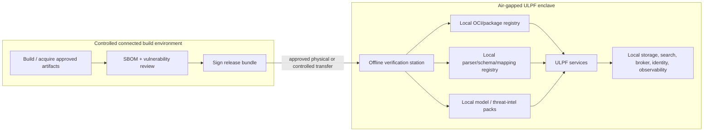
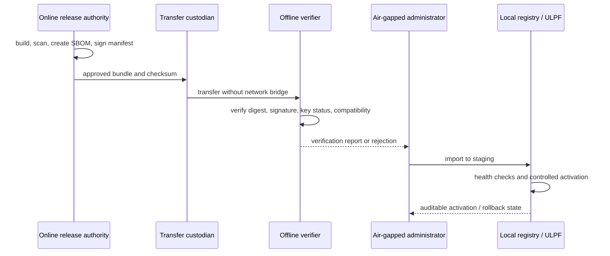

# Air-Gapped Architecture

## Principle

Air-gapped operation is a core runtime capability, not a deferred feature. ULPF must ingest, parse, normalize, preserve evidence, search, replay, administer, observe, and use any enabled AI/enrichment capability without a cloud API, external SaaS, or Internet connection. Online connectivity may be used only in a separately controlled build/update environment.

## Runtime dependency policy

Every dependency is classified explicitly. The categories describe the
air-gapped reference deployment, not a claim that every listed product has
already been installed.

| Dependency/capability | Classification | Air-gapped rule |
| --- | --- | --- |
| collectors, ingress, parser/normalization workers, UCE validation, lineage, API/UI | **Mandatory offline** | Must run locally for the core NTRO path. |
| raw evidence/object store, metadata/governance store, parser/schema/mapping registry | **Mandatory offline** | Must be locally reachable; no Internet substitute is permitted. |
| local identity/RBAC, audit, trusted public keys, local clock process | **Mandatory offline** for a secured multi-user deployment | Must remain locally operable; a developer profile may use a bounded local test identity. |
| local broker, operational search, and lake writer | **Mandatory offline when that enabled profile uses streaming/search/lake delivery** | Must have local deployment artifacts; their absence may only disable the corresponding declared capability, not delete accepted evidence. |
| local observability (logs, metrics, traces, health) | **Mandatory offline** | At minimum, local health and security-relevant signals must remain available. |
| local model/embedding service, asset/GeoIP/ASN/threat-intelligence packs, advanced correlation | **Optional offline** | May enhance onboarding/analytics; absence never stops deterministic core processing. |
| Kubernetes, graph projection, advanced local LLM, remote aggregation export | **Optional offline** | May be added only through approved local artifacts and remains outside the MVP critical path. |
| connected dependency acquisition, vulnerability research, public-dataset discovery, connected release build/signing preparation | **Online only** | Happens in a separate controlled build/update zone; it is not an air-gapped runtime dependency. |
| public cloud control planes, public package registries at runtime, external SaaS SIEM, hosted AI APIs, public threat-intelligence APIs, Internet NTP/DNS, remote maps/CDNs | **Not required** | Core runtime must neither require nor silently call them. |

No runtime component may make an undisclosed outbound Internet call. Package managers, telemetry SDKs, model clients, map/GeoIP libraries, and update checkers must be configured or tested for offline behavior.

## Signed update bundle

An air-gap release is a manifest-driven bundle, not an ad hoc folder copy. It may include OCI images, application and configuration artifacts, parser/schema/mapping packs, local model weights, local threat-intelligence/enrichment packs, migration instructions, SBOMs, dependency/image digests, release notes, signatures, and revocation information available at the time of export.

The verifier rejects an unknown signer, invalid signature, digest mismatch, incompatible contract/schema, or incomplete dependency set. It does not “repair” a failed bundle. Activation is staged: import, validate, test/health check, approve, activate, monitor; rollback selects a prior signed package and preserves the audit record.

## Local registries and provenance

The enclave maintains local registries for OCI images, parser packs, schema/mapping packs, configuration baselines, models, and intelligence packs. Each artifact has a stable ID, semantic version, content digest, signature/key ID, compatibility range, source/provenance statement, review/approval status, and import/activation audit records. Development artifacts may be locally built but cannot be represented as verified production artifacts without the defined promotion process.

Public verification keys are imported through a controlled trust-root process and rotated/revoked under a documented offline procedure. Signing keys remain outside the runtime environment. The system keeps historic public keys needed to validate historic evidence seals and approved artifact signatures.

## Operations in an enclosure

Administrators need an offline status page/report for registry versions, signature health, local storage capacity, broker health, model/enrichment pack availability, clock state, and any blocked outbound attempts. Documentation and API specifications needed to operate ULPF are bundled locally. Support exports must be scrubbed of raw evidence/secrets and follow an approved, auditable transfer process.

AI unavailability and missing enrichment packs are expected degraded states: deterministic format detection/parsing continues when possible, and outputs state that enrichment/AI was unavailable rather than fabricating a value.

## Technology and deployment choice

The reference is Docker/OCI containers with a local OCI registry and a signed manifest format; Kafka-compatible transport, PostgreSQL, MinIO, OpenSearch, and local OIDC/observability services all have offline-capable deployment paths. Kubernetes is a future cluster orchestration option, not an air-gap prerequisite. Tool selection must consider license terms, update cadence, image availability, CVE process, hardware requirements, and ability to bootstrap offline.

## Verification and acceptance

Air-gap acceptance requires a network-isolated test in which normal ingest, parse, evidence verification, search, replay, and local administration work with DNS/Internet egress unavailable. It also requires a negative test for an invalid signed bundle and a successful staged import/rollback using a pre-approved artifact. The test report must state exact scope; it must not claim certification merely because no-egress was tested once.
