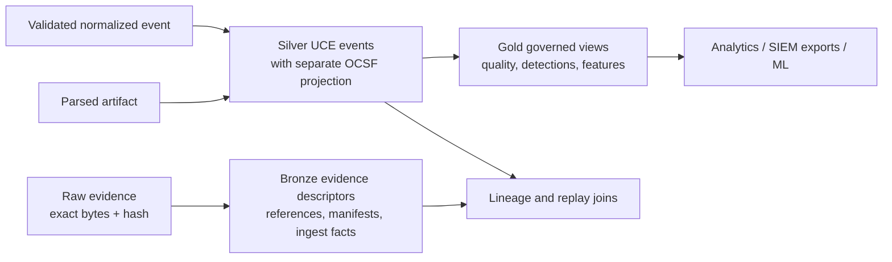

# Data Lake Architecture

## Role and boundary

The ULPF data lake is the scalable analytical destination for standardized, versioned event records. It enables downstream threat hunting, bulk correlation, reporting, and future ML feature preparation without turning ULPF into a full SIEM or requiring an external cloud warehouse. It does not replace the authoritative raw-evidence store.

The target design uses Parquet data files governed by an Iceberg-compatible table layer. For the hackathon MVP, a small, documented set of partitioned Parquet fixtures can demonstrate the contract; an Iceberg catalog is an advanced-MVP/production capability, not a prerequisite for pretending that lake-scale operation exists.

## Zones and contents

| Zone | Content | Mutability | Evidence rule |
| --- | --- | --- | --- |
| Bronze | evidence descriptors, raw object references, hashes, arrival/source metadata, ingest outcome | append-only | raw bytes remain in the evidence store; bronze records point to them and retain the proof fields |
| Silver | parsed and normalized events, unmapped-field references, quality, parser/mapping/schema versions, lineage root | append plus versioned corrections | each record retains `raw_event_id` and artifact lineage; no inferred value is labelled observed |
| Gold | governed aggregates, analytic views, feature sets, export-ready projections | reproducible/rebuildable | derived outputs retain source-table version and lineage references |

No zone may erase unknown fields. High-cardinality vendor payloads remain in a controlled `unmapped_fields` artifact/reference rather than causing uncontrolled column creation.

## Table format and schema evolution

Parquet is selected for portable, compressed columnar storage. Iceberg-compatible metadata is selected for future snapshots, partition evolution, schema evolution, compaction, and time-travel queries. An implementation must not expose a table as an immutable forensic record merely because it uses a lake table format: the evidence record and append-only lineage remain the forensic source.

Rules for evolution:

1. Canonical and output schema versions are explicit in every Silver row.
2. Additive fields are preferred; removed/renamed semantics require a migration decision and compatibility mapping.
3. A changed parser/mapping produces a new normalized output revision, never in-place mutation of a previous one.
4. A table snapshot identifies the contract/schema and source processing version used to generate it.
5. Compaction changes file layout only; it must preserve row identity, lineage, and snapshot auditability.

## Partitioning and file management

The default partition strategy is event-date with a bounded source family or tenant/security domain where needed. Partition keys must be low to moderate cardinality; raw device IDs and unconstrained vendor fields do not belong in path partitions. Event-time and ingestion-time are retained so late data can be written to the correct event-date partition with a processing-time record.

Lake writers batch records, write a staged file, validate row count/contract/hash metadata, then commit a manifest/snapshot atomically. Failed writes retain their input work reference and become retryable/quarantined workflow state. Small-file compaction is scheduled and observable. The lake writer never acknowledges a source event as fully delivered until its configured sink contract is met.

## Interoperability and analytics

Silver stores UCE as the internal canonical event data. OCSF is a separate,
versioned cybersecurity projection where applicable; it is not a second
canonical schema. Output adapters can create Parquet extracts and JSON/NDJSON,
OCSF, OpenTelemetry, ECS, REST, or Kafka representations without making any
external vendor schema the internal authority. Gold datasets may include
data-quality rollups, drift summaries, and explicitly versioned feature views.
Any ML consumer must record input snapshot, feature definition version, and
training/inference provenance.

## Governance, privacy, and access

Lake access is role- and policy-governed. Tables inherit classification from source/evidence policy; sensitive fields may require column-level filtering or a de-identified governed view. De-identification never alters original evidence. Export jobs carry a purpose, actor, destination, approved field set, snapshot ID, and audit record. A legal or forensic hold applies across raw evidence, Silver lineage, and relevant Gold derivatives.

## Retention and recovery

Raw evidence lifetime governs the minimum recoverability required to reproduce an associated normalized record. Silver snapshots and metadata are backed up with their catalog; Parquet data is stored in replicated object storage. Gold views are rebuildable from Silver when definitions are retained. Expiring an OpenSearch projection does not expire lake data or evidence. Restore testing must demonstrate recovery of a snapshot and verification that its `raw_event_id` references still resolve to valid evidence/manifests.

## Technology evaluation

| Candidates | Evaluation criteria | Selected design | Trade-off / fallback |
| --- | --- | --- | --- |
| Parquet files, Apache Iceberg, Delta Lake, warehouse-specific formats | offline operation, schema evolution, partition control, portability, team capacity | Parquet plus Iceberg-compatible table management | Iceberg adds catalog/operations work. MVP can publish immutable partitioned Parquet plus manifests, then migrate with a controlled ADR-backed catalog adoption. |
| local catalog, PostgreSQL-backed catalog, REST catalog | air-gap, recovery, deployment simplicity | local/PostgreSQL-backed catalog is the planning baseline | catalog choice remains replaceable behind lake-writer/table interfaces |
| Spark/Flink/Trino/embedded readers | batch scale, SQL needs, operational complexity | no engine is mandatory in core MVP; define lake contracts first | choose a query engine later through a measured implementation ADR |

## Acceptance criteria

The future implementation must demonstrate a versioned normalized event written to a valid partition, a lake query or manifest lookup that reaches its raw evidence reference, a schema-compatible additive evolution, a late-event path, and a replay producing a separately identifiable output revision. Any scale statement requires measured benchmark evidence documented under [Performance Strategy](PERFORMANCE_STRATEGY.md).
