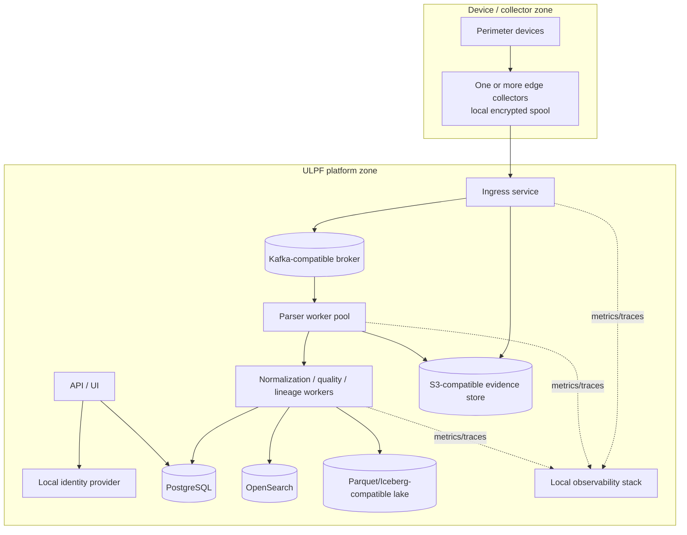

# Deployment Architecture

## Deployment strategy

ULPF is designed to run locally, on-premises, and in an air-gapped environment. Docker/OCI containers and configuration-driven interfaces provide platform portability. Docker Compose is the reference for developer, demo, and single-node production-like setups because it is practical for a six-member team. Kubernetes is a future scaling deployment option, not an MVP requirement.

## Environment profiles

| Profile | Purpose | Topology | Explicit limitation |
| --- | --- | --- | --- |
| developer | contract and unit/integration work | local services or test doubles, fixtures, isolated developer data | no performance/availability conclusion |
| hackathon demo | repeatable 2-minute proof | single machine, containerized bounded stack, sample corpus | single failure domain; demonstrate behavior, not large-enterprise scale |
| single-node production-like | controlled pilot/small deployment | durable volumes, local auth/monitoring, separate process/container responsibilities | hardware or host failure interrupts service; recovery plan required |
| scaled on-premises | capacity/resilience target | replicated broker/storage/search as justified, stateless worker replicas, externalized config | requires measured capacity, operator runbooks, and failure testing |
| air-gapped | isolated operations | any of the above using local registries, local dependencies, signed imports | updates and intelligence require controlled offline transfer |

## Service responsibilities

| Service group | Responsibility | State and scaling rule |
| --- | --- | --- |
| collector/ingress | protocol handling, authentication/rate controls, evidence durability, raw reference publication | collectors retain bounded local spool; ingress scales behind a controlled listener |
| parser workers | format detection, deterministic parsing, bounded artifact output | stateless consumers; isolate and scale by partitions/lag |
| normalization workers | mapping, validation, quality, lineage, output references | stateless consumers with idempotent writes |
| control plane/API/UI | registry, onboarding, source administration, investigation/replay workflows | API is stateless; governance data lives in PostgreSQL |
| stateful data plane | broker, PostgreSQL, evidence/object store, search, lake/catalog | separate durable volumes, backups, capacity and recovery ownership |
| identity/observability | local authentication, metrics/traces/logs, health/alerting | isolated credentials and retained operational data |

## Configuration and deployment controls

Deployment configuration is layered by environment and contains only non-secret settings: service endpoints, resource limits, storage policy references, retention profile, enabled integrations, feature flags, and allowed network paths. Secrets are injected through a protected deployment mechanism and never committed to source control. Each deployment records image digests, configuration version, parser/schema baseline, migration state, and health outcome.

Containers run non-root with read-only filesystems where possible, minimal capabilities, explicit resource limits, no Docker socket, and only required mounts. Stateful volumes have a documented backup class. Admission/deployment checks verify signatures/digests, configuration schema, required secrets, storage availability, and compatibility of contracts/migrations before activation.

## Network segmentation and traffic

Only ingress is reachable from collector networks; only the UI/API gateway is reachable from authorized administrative networks. Parser workers cannot reach Internet endpoints and receive narrowly scoped access to broker/artifact services. Direct object-store, database, and broker administrative ports are restricted to service/admin networks. TLS/mTLS and identity policy are applied according to the risk of each boundary.

## Scale and resilience path

Workers scale independently using measured consumer lag, latency, saturation, and queue distribution. Stateful components scale through their own supported replication patterns; ULPF does not treat an arbitrary number of containers as HA. A transition from Compose to Kubernetes preserves container images, contracts, configuration schema, persistent-data migration plans, health checks, and observability semantics. It must be rehearsed before being called production-ready.

## Technology evaluation

| Concern | Candidates | Evaluation criteria | Decision | Fallback |
| --- | --- | --- | --- | --- |
| container runtime/package | Docker Compose, Podman Compose, Kubernetes | portability, offline packaging, team fluency, operational burden | OCI images + Docker Compose reference for MVP | Podman-compatible runtime where site policy requires; preserve OCI/config contracts |
| orchestration | Compose, Kubernetes, managed cloud services | air-gap support, stateful operations, scaling, six-person capacity | Compose now; Kubernetes only for later clustered deployment | remain on hardened single-node profile until cluster staffing and tests exist |
| service architecture | monolith, modular services, serverless | isolation, testability, deployment complexity | modular services/processes with explicit contracts; co-locate when MVP simplicity warrants | start with a small number of deployable units but do not entangle parser/evidence/control-plane boundaries |

## Deployment acceptance criteria

A profile is ready only when a clean machine can use documented offline-capable artifacts/configuration to start it; health/readiness surfaces show critical dependencies; raw evidence survives a worker restart; service permissions are least-privilege; configuration/secrets are not leaked; and restore/degraded-mode tests meet the declared profile scope. No profile may be labelled HA or enterprise scale without measured and documented evidence.
