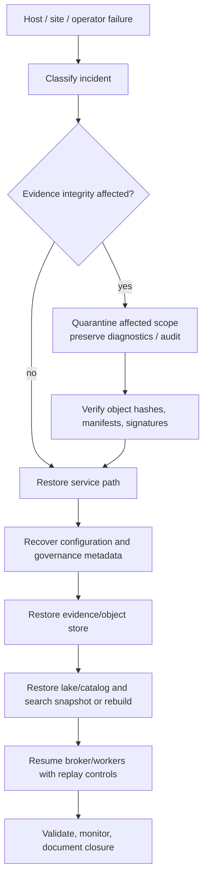

# Disaster Recovery and Resilience

## Purpose and scope

This plan describes how ULPF preserves evidence integrity and restores service after component, host, storage, configuration, or operator failures. Recovery objectives (RTO/RPO), retention duration, replication factor, and acceptable data-loss windows are deployment-specific risk decisions; Phase 0 intentionally does not invent them. Those decisions must be recorded before a production-like deployment.

The first recovery priority is truthful evidence custody: never hide loss, fabricate a recovered manifest, or overwrite a disputed output while attempting to restore availability.

## Failure-domain model

## Component recovery strategy

| Component/failure | Designed behavior | Recovery evidence |
| --- | --- | --- |
| edge collector/network disruption | persisted local spool forwards on recovery; capacity exhaustion is visible | collector queue state, receipt/retry logs without raw leakage |
| broker interruption | ingest slows/spools; consumers resume from durable offsets; idempotent sinks tolerate redelivery | lag/offset and duplicate-link records |
| parser worker crash | work rebalances/retries; resource violation may quarantine input | worker restart, retry/DLQ and lineage state |
| PostgreSQL loss/corruption | restore governance/audit/evidence-catalog backup; reconcile artifact references | backup integrity, migration/config version, reconciliation report |
| object-store loss/corruption | restore immutable objects/manifests from replicated encrypted backup; verify before service use | object hashes, seal/signature verification, restore audit |
| OpenSearch loss | restore snapshot or rebuild projection from normalized artifacts/lake; raw evidence unchanged | index build version/counts and sampled lineage traversal |
| lake/catalog failure | restore table metadata and files/snapshots; rebuild Gold from Silver if definitions retained | snapshot/catalog integrity and raw-reference validation |
| identity/secrets outage | use documented emergency break-glass process with dual control where available; rotate after use | emergency authorization audit and key/secret rotation record |
| bad parser/schema/mapping release | halt activation, rollback active version for new events, replay affected range into new revision | approval/rollback audit and before/after replay comparison |
| compromised bundle/signing key | disable key/artifact, quarantine affected releases, import revocation/update through controlled path | incident record, trust-root update, verification report |

## Backup policy and protection

Backups include PostgreSQL governance/audit data, object-store evidence and manifests, lake data/catalog metadata, OpenSearch snapshots, infrastructure/configuration baselines, parser/schema/mapping registries, and historic public keys necessary to verify seals. Kafka data may be included where its configured retention is operationally valuable, but it is not a substitute for evidence backups.

Backups are encrypted, access-controlled, versioned/immutable where supported, and inventoried. They must be kept separate enough from the primary failure domain to meet the operator’s resilience policy. Backup success alone is insufficient: periodic restore exercises verify integrity, application compatibility, and a representative evidence/lineage traversal.

## Degraded-mode rules

| Lost capability | Allowed degraded behavior | Prohibited behavior |
| --- | --- | --- |
| enrichment or local AI | continue deterministic parsing; label unavailable dependency | invent enriched/inferred values or stop known-format parsing solely for AI |
| search index | preserve/process evidence and normalized artifacts; queue/rebuild search projection | declare evidence unavailable because search is down |
| export destination | retain durable work and retry/alert | drop delivery silently or lose source traceability |
| parser registry access | process only already verified active versions if locally cached and policy permits | fetch an unverified remote pack or execute fallback code |
| evidence verification failure | restrict affected evidence/output, alert/investigate | silently substitute, reseal, or delete evidence |

## Recovery runbook sequence

1. Declare the incident, preserve logs/audit material, classify affected data and authority.
2. Stop unsafe writes/activations and isolate suspected credentials, hosts, packs, or storage scopes.
3. Select a known-good, signed configuration/image/registry baseline and validate compatibility.
4. Restore governance metadata and evidence storage; verify manifests, signatures, and sampled/full policy-required content hashes before exposing evidence.
5. Restore analytical and search projections from verified data, preserving output revisions rather than overwriting them.
6. Resume consumers with pinned versions and controlled replay; monitor duplicates, backlog, and DLQ state.
7. Reconcile receipt IDs, evidence references, manifests, and lineage; open investigations for discrepancies.
8. Obtain authorized closure, document impact and remediation, and improve the backup/drill plan.

## Drill and acceptance requirements

Every deployment profile has a scheduled, scoped restore drill. At minimum, test worker restart, downstream outage, recovery from a bad parser release, evidence-object restore plus hash/manifest verification, PostgreSQL catalog restore, and search rebuild. Air-gapped drills must use locally available signed artifacts only. Report the measured recovery time, data scope, exceptions, and open findings; never substitute a generic target for an observed result.
