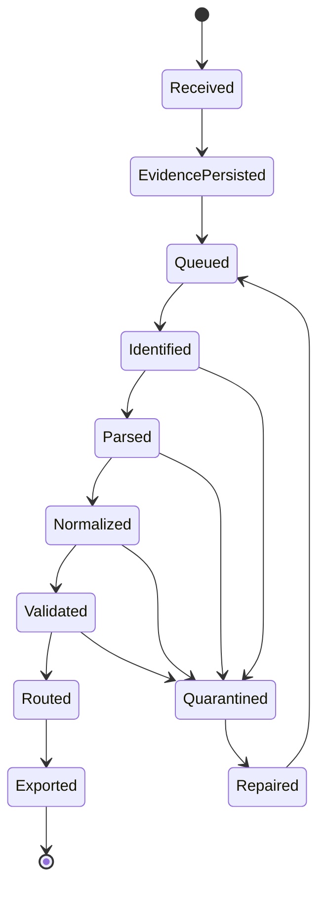
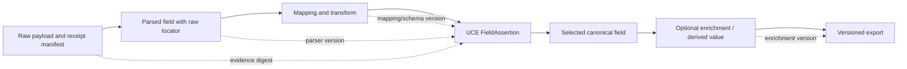

# ULPF Event Model

**Status:** Phase 0 conceptual contract. ULPF Universal Canonical Event (UCE) is the one versioned internal canonical representation; the JSON Schema contracts are design artifacts, not a deployed API.

## 1. Event-family contracts

| Contract | Purpose | Evidence rule |
|---|---|---|
| RawEvent | Accepted source content and receipt/transport metadata | Original payload is retained by reference with hash, length, encoding, and storage version. |
| ParsedEvent | Source-specific typed fields, structural parse result, diagnostics | Links values to raw locators; never replaces RawEvent. |
| NormalizedEvent / UCE | Common taxonomy, provenance, quality, integrity, unknown fields, output readiness | Requires a RawEvent link and lineage reference. |
| DLQEvent | Failure/quarantine record for an accepted event | Names failed stage/reason and preserves raw/processing references. |
| ReplayJob | Governed reprocessing request with pinned versions | Produces a new result; never mutates historical output. |
| LineageRecord | Event/field transformation edge | Binds inputs/outputs to versions, actor/run, time, and explanation. |
| AuditEvent | Security/governance action | Records actor, authorization outcome, correlation, and time. |

The machine-readable baseline is in [`contracts/jsonschema`](../contracts/jsonschema/).

## 2. Canonical UCE envelope

| Section | Required conceptual fields | Purpose |
|---|---|---|
| Identity | normalized event ID, raw event ID, processing job ID, fingerprint, canonical schema ID/version | Stable linkage, replay, idempotency, and interpretation |
| Time | event time, precision/source, receipt time, processing time, sequence/clock-skew markers | Preserve source and platform times separately |
| Source/device | source ID/profile version, vendor/product, device identifiers, collector/transport context | Establish contextual identity without unsupported guesses |
| Classification | category, class/type, action, outcome, severity, protocol, message/summary, vocabulary references | Consistent security semantics |
| Network/entities | source/destination/intermediate IP/port, protocol, direction, user/identity where available | Perimeter-security activity representation |
| Evidence | evidence ID, raw locator/reference, digest/algorithm, length, encoding, raw timestamp candidate | Retrieval/verification without copying raw payload into every projection |
| Processing | parser/mapping/schema versions, enrichment set, run identity, format decision | Reproduce/compare interpretation |
| Assertions | selected values and FieldAssertions, raw paths/spans, transformation/origin/confidence | Prevent assertions from looking like source evidence |
| Unmapped/unknown | source-native name/path/value/type, opaque fragments, parse residue, unknown state | Preserve what ULPF cannot yet interpret |
| Quality/errors | validation status, quality dimensions, warnings/errors, DLQ reference | Make uncertainty and faults queryable |
| Integrity/audit | evidence/artifact digests, manifest/verification status | Chain evidence to governed processing |
| Privacy/access | sensitivity tags, masking-policy reference, retention/legal-hold state | Control display/export without changing evidence |

## 3. Assertion-origin model

Every field with security meaning has an origin. The origin is as important as the value.

| Origin | Definition | Example | Can it be treated as an observed fact? |
|---|---|---|---|
| Observed | Directly represented in raw evidence and deterministically extracted | a source IP read from a valid CEF field | Yes, after parser/mapping validation |
| Inferred | Proposed from patterns, heuristics, local model, or incomplete evidence | candidate event class inferred from a message pattern | No; retain confidence and approval state |
| Enriched | Joined from a separate local knowledge source | asset criticality associated with an IP | No; it remains an external assertion |
| Derived | Computed from declared inputs/processing context | normalized severity bucket | Not raw observation; it is a declared calculation |

A FieldAssertion includes field path, value/type, origin, confidence, raw locator(s), extractor/mapping/transform IDs, source artifact versions, creation time, and optional human approval reference. The query-friendly UCE value is selected from assertions without erasing alternatives/conflicts.

## 4. Evidence and raw-field locators

| Input form | Planned locator form |
|---|---|
| JSON/XML | Structured pointer/path and optional byte span |
| CSV | Record number, header/name, column index, optional byte span |
| CEF/LEEF/key=value | Header/extension key and optional character span |
| Syslog/free text | Token/capture name and character/byte span |
| Binary/opaque | Byte range plus encoding/content type |

Locators explain an interpretation. They are not executable expressions and must never cause log content to execute.

## 5. Event lifecycle

Raw evidence persists from `EvidencePersisted` onward regardless of later state. `Exported` is a delivery result, not destruction of canonical history.

## 6. Raw-to-normalized lineage

A field trace returns raw-event ID, evidence digest, raw locator, parser/mapping/schema versions, transformation IDs, origin, confidence, processing job, and enrichment/output steps.

## 7. Canonical semantic groups

The UCE does not require irrelevant fields. Absence is distinct from empty, invalid, unknown, and not-applicable.

| Group | Examples |
|---|---|
| Event | ID, category, type/class, action, outcome, message, severity |
| Time | event/receipt/processing time, sequence, timezone/precision |
| Network | source/destination/translated/intermediate IPs, ports, protocol, direction, zone |
| Device | vendor, product, device ID/name/type, firmware/version if observed |
| Identity | user, account, principal, session, authentication context if available |
| Security | rule/policy IDs, indicators, disposition, IDS signature, risk context |
| Evidence/provenance | raw reference, hashes, locators, versions, lineage, assertion origins |
| Processing | format decision, quality score, warning/error codes, queue/run latency |
| Extensions | namespaced source-native/future fields with type and origin |

## 8. Identity, duplication, ordering, and evolution

- `raw_event_id` identifies a durable receipt; identical payloads may still be separate occurrences.
- `normalized_event_id` identifies the result of one RawEvent under one pinned processing-artifact set. Replays create new result IDs.
- A fingerprint supports duplicate relationship detection but never suppresses raw evidence.
- Event, receipt, and processing time remain distinct; source sequence, transport offset, timezone/precision, late-event, and clock-skew state are retained.
- UCE uses semantic versioning: patch clarifies, minor adds compatible optionality, major changes incompatible structure/meaning. Unsupported major versions are rejected/quarantined, not silently coerced.

## 9. Hard invariants

1. No accepted RawEvent is silently discarded or overwritten.
2. Every NormalizedEvent links to RawEvent evidence and verification material.
3. Every selected value declares observed, inferred, enriched, or derived origin with lineage.
4. Unmapped data and parse residue remain recoverable.
5. AI output remains inferred until a governed parser/mapping artifact is approved; it never changes raw evidence.
6. Errors, warnings, validation state, and uncertainty are data, not hidden log messages.

## 10. Canonical hierarchy and minimum traceability representation

UCE is the sole canonical event representation inside ULPF. RawEvent is
immutable evidence and ParsedEvent is a source-specific intermediate. OCSF,
OpenTelemetry Logs, ECS, JSON/NDJSON, REST/HTTP, Kafka, and Parquet are output
projections from UCE.

The NormalizedEvent/UCE and Lineage contracts require enough information to
answer, without inference, how a result was produced:

- raw event ID, source ID, immutable evidence payload reference, raw SHA-256,
  and evidence-manifest ID;
- processing run ID, versioned source profile, parser, mapping, and schema;
- processing timestamp plus stage records with inputs, outputs, versions, and
  outcome;
- field output path, raw/input paths, transformation ID, origin, and confidence;
- enrichment version/status/time when enrichment was requested or applied;
- the lineage artifact reference and audit/approval reference when an inferred
  mapping was approved.

An event cannot be marked as a completed normalized result if required
lineage/evidence references are missing. A failure before parser selection is
explicitly represented as not selected, not reached, or unknown source; ULPF
never fabricates a parser version.
