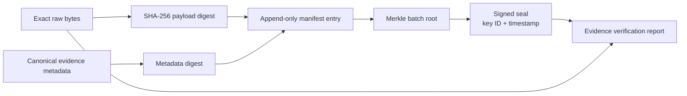

# Evidence Architecture

## Evidence invariant

ULPF treats the exact received payload as forensic evidence. The raw byte sequence is never silently changed, truncated, normalized, deduplicated away, or replaced by parsed fields. Decode attempts, line framing, transport metadata, and later transformations are separate artifacts linked to the original evidence.

This document specifies the design, not a claim that write-once storage or cryptographic keys have already been provisioned. See [ADR-005](adr/ADR-005-immutable-raw-evidence-storage.md) and [ADR-006](adr/ADR-006-evidence-integrity-with-hashes-and-manifests.md).

## Evidence record

On receipt, ingress creates a unique `raw_event_id` and stores:

- the exact bytes received after the transport boundary, plus byte length and declared/observed encoding;
- source identity, collector identity, transport metadata, receipt and ingest timestamps, and original timestamp when extractable;
- a SHA-256 digest of exact bytes and a separately canonicalized evidence-metadata digest;
- immutable object reference, retention/hold state, encryption/key reference, and ingest outcome;
- parser, mapping, schema, and transformation references only when they later become known;
- evidence-manifest and lineage references.

`raw_event_id` identifies the receipt. A content hash may reveal identical payloads but does not merge receipts. If the input is a batch, the batch bytes and the framed child-event boundaries are both retained so a child event can be traced to the original transport evidence.

```mermaid
sequenceDiagram
  participant C as Collector
  participant I as Ingress
  participant O as Evidence object store
  participant M as Manifest service
  participant K as Work stream
  C->>I: exact payload bytes + transport context
  I->>I: assign raw_event_id; SHA-256 exact bytes
  I->>O: write immutable encrypted evidence object
  O-->>I: object reference + durable write result
  I->>M: append evidence metadata digest
  M-->>I: manifest membership / pending seal
  I->>K: publish raw-event reference only after durable evidence write
  I-->>C: acknowledge according to configured durability policy
```

## Integrity model

The baseline is simple, reviewable, and sufficient for the stated objective:

1. SHA-256 protects exact raw content verification.
2. An append-only evidence manifest binds `raw_event_id`, raw digest, object reference, source/collector, receipt time, byte length, and previous manifest digest.
3. Periodically sealed batches compute a Merkle root over manifest entries and are signed with an organization-controlled signing key (Ed25519 is the reference choice). The seal records key ID, algorithm, timestamp, and prior seal reference.
4. Object-store versioning/immutability and retention controls protect storage; access and export are audited.
5. A verifier recomputes the object digest, verifies manifest-chain linkage, verifies Merkle membership, and verifies the signature before declaring an evidence result valid.

The signed seal does not prove that a device generated a log; it proves that the stored bytes and recorded custody metadata have not been altered undetectably since ULPF accepted them, subject to the trustworthiness of the key and storage controls.



## Chain of custody and access

The evidence catalog records every state-changing operation: ingest, integrity verification, hold/release, retention action, export request/approval/completion, replay selection, restore, and detected inconsistency. Every raw retrieval and export records subject, role, purpose, time, object/reference, result, and correlation ID. Audit records are append-only and protected separately from normal application logs.

Raw evidence needs a stricter permission than ordinary normalized-event search. A Security Analyst may see a policy-filtered projection; an Auditor or appropriately authorized investigator may retrieve exact raw bytes. Export requires explicit authorization, generated digest/manifest, destination classification, and an audit receipt.

## Failure and tamper behavior

| Condition | Required behavior |
| --- | --- |
| object write cannot become durable | do not publish work or report durable acceptance; collector retries/spools |
| payload hash mismatch on read | mark evidence `integrity_failed`, preserve the object and records, restrict export, alert and investigate |
| manifest/seal verification fails | quarantine affected result set, preserve diagnostics, never regenerate a replacement manifest silently |
| parser transforms incorrectly | retain prior output and produce a new version through replay; raw evidence remains unchanged |
| duplicate receipt | preserve both receipt IDs and link duplicate relationship if detected |
| retention expiry under hold | hold overrides automated deletion; all action remains audited |

## Storage, keys, and export

Evidence objects are encrypted at rest with deployment-managed keys; transit uses authenticated encryption. Signing keys are distinct from storage-encryption keys, held in an offline or protected key-management process, rotated under an audited policy, and retained long enough to verify historic seals. Air-gapped deployments receive trusted public keys and signed bundle keys through the controlled update process.

Exports are immutable packages containing selected evidence objects or references, a manifest, hashes, seal references, export metadata, and verification instructions. A user never receives an unlabelled derived file as if it were original evidence.

## Retention, backup, and restoration

Retention policies depend on source classification, legal/forensic requirements, and capacity. The architecture does not invent fixed retention durations. Replicated encrypted backups include objects, manifests/seals, catalog pointers, and required historic public keys. A restore is incomplete until a sampled or policy-required set verifies hashes and manifest/seal lineage.

## Why not blockchain

An append-only manifest chain with signed Merkle seals provides integrity, efficient proof, offline verification, and a clear trust model without distributed-consensus infrastructure. Blockchain would add operational and key-management complexity without improving raw-event custody under one organization’s control. It is not selected; see [ADR-016](adr/ADR-016-no-blockchain-for-evidence-integrity.md).

## Acceptance criteria

The implementation must test byte-for-byte retrieval, hash mismatch detection, manifest and signature verification, duplicate receipt preservation, protected export, restore validation, parser-version replay, and an audit trail for every privileged evidence operation. No demonstration may call data “tamper-proof”; it should show the exact verification evidence and state the trust boundary.
