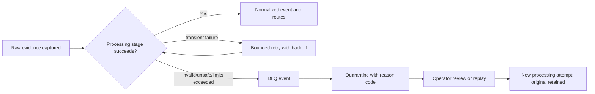

# Interoperability, Data Quality, and Operational Processing

## Output boundary

ULPF is a preprocessing and intelligence fabric, not a full SIEM. It owns source onboarding, evidence, parsing, semantic normalization, lineage, quality, controlled routing, and a focused exploration experience. Downstream platforms own long-running detection content, case management, remediation, broad SOC operations, and enterprise-wide analytics unless a later phase explicitly adds a bounded adapter.

| Adapter | Intended consumer | Guarantees and limits |
| --- | --- | --- |
| UCE JSON / NDJSON | generic consumers | Preserves ULPF semantics and evidence references; not a raw-evidence export by default |
| OCSF projection | cybersecurity data lakes/SIEMs | Primary security interoperability projection; versioned mapping and provenance retained |
| OpenTelemetry Logs projection | observability ecosystems | Log-record semantics, resource attributes, trace compatibility where available |
| ECS projection | Elastic-compatible downstream users | Explicit adapter, never the internal source of truth |
| Kafka topic | streaming consumers | Versioned message envelope, authorization and retention controls |
| Parquet / Iceberg-compatible table | lake/ML analytics | Partitioned batch delivery, schema-evolution and catalog policy |
| REST/HTTP | controlled integration | Idempotency keys, paginated search, scoped authorization, audit of exports |

## Quality model

Every normalized event gets a transparent 0-100 quality score plus component signals. It is an operational indicator, not a truth score and never changes raw evidence.

| Signal | Event-level treatment | Source/pipeline roll-up |
| --- | --- | --- |
| Parser success and warnings | parsed/partial/failed plus reason | success and malformed rates |
| Required field completeness | missing canonical fields listed | completeness trend by source/parser version |
| Normalization coverage | mapped vs recoverable unmapped field ratio | mapping health and backlog |
| Time/type/semantic validity | explicit validation results | clock, vocabulary, and schema-drift indicators |
| Enrichment outcome | separate optional status | feed freshness and success rate |
| Drift and confidence | proposed/approved state, not evidence | review queue and regression signal |

## Explicit failure path

Failures are categorized as unsupported format, malformed syntax, validation failure, transformation failure, enrichment failure, timeout, resource exhaustion, or destination failure. Each has a severity, retry policy, reason code, evidence reference, and operator-visible status. Failures do not silently discard or overwrite the raw event.

## Idempotency, duplication, and ordering

`raw_event_id` identifies each capture; a stable content fingerprint, source identity, capture time/sequence, and transport metadata support duplicate relationship detection. Evidence is retained even if a logical duplicate is detected. Consumers use idempotent writes keyed by event identity/version. Partition ordering is honored only where a source partition/key makes it meaningful; event-time, ingestion-time, sequence number, and late/clock-skew markers remain distinct.

## Enrichment and analytics

Enrichment is a reversible, separately versioned overlay from local asset, GeoIP, DNS, ASN, network-zone, device-criticality, identity, or threat-intelligence packs. It is labeled `enriched`, records provenance and feed version, and failure does not block the base normalized event.

Search, filtering, aggregations, timelines, correlation candidates, anomaly experiments, Sigma-compatible downstream workflows, and MITRE ATT&CK context consume normalized data. No analytics output is permitted to alter evidence or masquerade as an observed event field.
