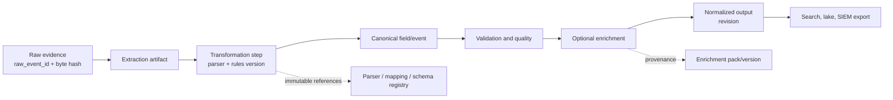
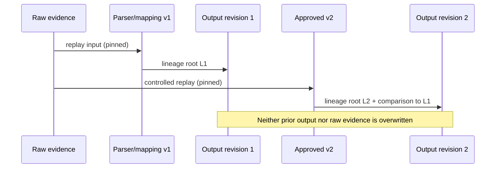

# Lineage Architecture

## Purpose

Lineage makes every ULPF output explainable: a reviewer can traverse a normalized value or downstream export to its raw receipt, parse artifact, rules, versions, transformations, enrichment, quality decisions, and custody record. It is required for traceability, replay, audit, safe parser evolution, and honest AI-assisted onboarding.

Lineage is not a mutable audit note attached after the fact. It is an append-only, versioned record produced by processing stages. A correction creates a new output revision with its own lineage; it never edits the historical explanation.

## Lineage model

| Record | Purpose | Required references |
| --- | --- | --- |
| event lineage root | ties a processing graph to one raw receipt | `raw_event_id`, raw hash, source ID, evidence manifest entry, ingest time |
| stage lineage record | records input, output, actor/service, deterministic operation and result | stage, input/output artifact IDs and digests, start/end time, code/config/version, status |
| field lineage record | explains one normalized field or field group | output field path, input raw/parsed paths or null, transformation rule, origin class, confidence, output revision |
| decision record | documents mapping approval, drift decision, manual repair, or AI suggestion use | actor, reason, reviewed artifact, policy/version, timestamp |
| output lineage record | associates a search/lake/export delivery with its normalized revision | destination, idempotency key, result, timestamp, output artifact digest |

Every record includes a contract version and correlation ID. IDs are stable and opaque; raw content is referenced, not duplicated into lineage tables or telemetry.

## Field origin taxonomy

Lineage must distinguish data origins so downstream consumers cannot mistake a suggestion for evidence.

| Origin class | Meaning | Minimum lineage requirements |
| --- | --- | --- |
| `observed` | exact or directly parsed source content | raw offset/path or framing reference, parser/version, conversion details |
| `derived` | deterministic calculation from named inputs | named input field lineage and formula/rule version |
| `inferred` | heuristic/AI/human hypothesis not directly present in raw data | model/prompt or rule version, confidence, explanation, reviewer/approval state |
| `enriched` | external/local contextual lookup | enrichment provider/pack version, lookup time, key source, result status |
| `system` | ULPF operational fact such as ingest time or quality score | generating component/version and source inputs |

An inferred field is always labelled as inferred even after approval. Approval authorizes use of a mapping configuration; it does not retroactively convert inferred event content into observed source content.

## Example traversal contract

An Event Details UI or API asks for an output field such as `network.destination.port`. ULPF returns the current normalized revision, its origin class, source raw field location or parsed token, parser/mapping/schema versions, transformations, validation outcome, enrichment (if any), raw evidence ID/hash, and links to the immutable audit/approval events. The UI must allow a user with raw-evidence permission to verify the linked bytes; users without that permission see a redacted reference rather than an unauthorized raw payload.

## Versioning, replay, and drift

Parser, mapping, schema, source-profile, enrichment-pack, model, and policy versions are first-class lineage inputs. A replay selects raw evidence plus pinned versions, produces a new run ID and output revision, and records an explicit comparison to the prior result. A parser rollback changes future processing activation only; it cannot erase output or lineage created under the withdrawn version.

Schema-drift findings link observed deviations to the source profile and affected event IDs. A published remedy becomes a new version and may trigger a controlled replay. This lets an investigator answer both “what did ULPF believe then?” and “what does the approved mapping produce now?”

## Storage, retention, and query design

The governance store holds append-only lineage indexes optimized for traversal by raw ID, normalized ID, output revision, field path, version, replay run, and time. Large artifacts remain in object storage with checksums. Search may carry selected lineage facets for investigation but cannot be the only lineage store. Retention of lineage/audit data must support the retention and proof obligations of the evidence it explains.

Graph-database adoption is not required for MVP. Relational/append-only records plus indexed references are easier for a six-member team to implement and audit. If complex cross-event relationship queries prove necessary, an additional graph projection can be evaluated without changing the immutable lineage contract.

## Failure behavior and verification

If a stage cannot create required lineage, it must not publish a completed normalized result. It retries or quarantines the work with an explicit `lineage_write_failed` state. A missing raw reference, unknown version, invalid digest, or cycle in the provenance graph is an integrity finding, not a cosmetic warning.

Acceptance tests must trace representative observed, derived, inferred, enriched, unknown/unmapped, failed, duplicate, and replayed events. Reviewers should be able to traverse forward from raw bytes to each output and backward from an output field to the exact evidence and governing versions.

## Minimum machine-readable lineage

The Lineage contract requires this root representation for each completed
NormalizedEvent/UCE:

| Element | Required value |
| --- | --- |
| Evidence identity | raw event ID, source ID, raw SHA-256, evidence-manifest ID |
| Result identity | normalized event ID, lineage ID, processing run ID |
| Governing artifacts | versioned source profile, parser, mapping, and schema references |
| Event-stage proof | stage, operation ID, timestamp, artifact versions, input/output references, and outcome |
| Field-level proof | output path, raw/input paths where available, origin, transformation ID, and confidence where applicable |
| Optional-context proof | enrichment version/status/time and approval-audit ID for approved inferred mappings |

For a failure before a parser can be selected, the DLQ contract records the
source/evidence context and an explicit parser-selection state rather than a
false parser reference. This preserves traceability without inventing
provenance.
