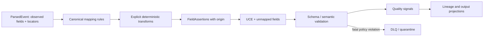

# Normalization and Data-quality Architecture

## Purpose

Normalization converts a ParsedEvent into a ULPF Universal Canonical Event (UCE) without confusing source evidence with interpretation. It is schema-driven, deterministic in production, versioned, and reversible through lineage and raw evidence. It does not delete unknown source fields to make a record look clean.

## Transformation pipeline

## Mapping rules

Each mapping is a signed/versioned manifest described by the [mapping contract](../contracts/jsonschema/mapping.v1.schema.json). A rule includes an ID, declared inputs, source path(s), target UCE path, deterministic operation, output type, controlled vocabulary, origin, default behavior, test fixtures, and an explanation.

| Rule type | Example | Provenance policy |
|---|---|---|
| Direct copy | observed CEF `src` to `event.source.ip` | `observed`, record raw path/span |
| Type conversion | source string port to integer port | `observed` value plus `derived` conversion detail |
| Vocabulary translation | vendor action `deny` to canonical `blocked` | observed source value retained; selected UCE value names mapping rule |
| Composition | format timestamp fields to RFC 3339 time | `derived` result cites all observed inputs and timezone policy |
| Default / classification | known source profile selects device type | `derived` or `inferred`, never `observed` |
| Enrichment | local asset database adds owner/criticality | `enriched`, records feed/version/lookup time |
| AI proposal | unknown sample suggests event class | `inferred`; cannot become active mapping until approved |

## Validation and quality

Validation happens after mapping and before routing. Rules are categorized `fatal`, `quarantine`, `warning`, or `informational`; no condition silently disappears. A warning-capable event can route with explicit quality signals only where the schema allows it.

| Quality dimension | Signal | Example response |
|---|---|---|
| Parse | complete/partial/failure, warning count | partial event may be valid but scored lower |
| Coverage | mapped required/available fields, unmapped ratio | source-profile or mapping review signal |
| Type/time | canonical types, timestamp precision/timezone/clock skew | invalid timestamp is retained with warning or quarantined by policy |
| Semantics | controlled-vocabulary and cross-field consistency | warn/quarantine on impossible protocol/port pairing |
| Lineage | all selected fields have origin and transformation | missing provenance is a validation failure |
| Enrichment | optional feed freshness/success | does not reduce base evidence correctness |

Scores make uncertainty visible; they are not an assertion of security risk or evidentiary truth. Scores, inputs, and formula versions are recorded so a later implementation can explain them.

## Unmapped fields, duplicates, and ordering

- Source fields with no semantic mapping remain in a namespaced `unmapped_fields` collection with original name/path, typed value when safely known, parse status, and observed provenance.
- Duplicate correlation uses a stable fingerprint and source/context/receipt information. It preserves each raw receipt and marks the relationship rather than suppressing evidence.
- Event time, receipt time, processing time, source sequence, transport offset, timezone/precision, and late/clock-skew state are distinct. A late event is not rewritten to appear on time.

## Output projections

UCE is authoritative internally. OCSF is the primary cybersecurity projection. OpenTelemetry Logs, ECS, NDJSON/JSON, Kafka, REST, and Parquet are explicit adapters. An output projection names the exact UCE, adapter, target-schema, and mapping versions; failure of a projection creates delivery status/retry work without corrupting the UCE.

## Acceptance criteria for implementation

1. The same raw input and pinned artifacts produce the same deterministic UCE, apart from declared run metadata.
2. Every mapped value declares observed, inferred, enriched, or derived origin and a trace to inputs/rules.
3. All unmapped fields and parse residue remain queryable/recoverable.
4. Validation and quality results are explicit, versioned, testable, and observable.
5. Reprocessing with a new version produces a distinct result and comparison record; it never overwrites the earlier normalized event.
