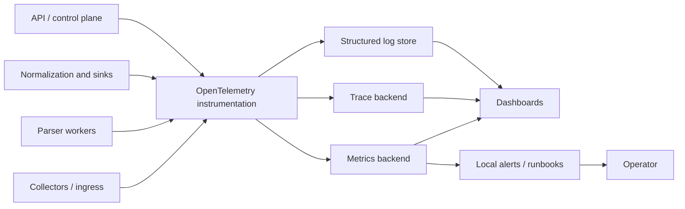
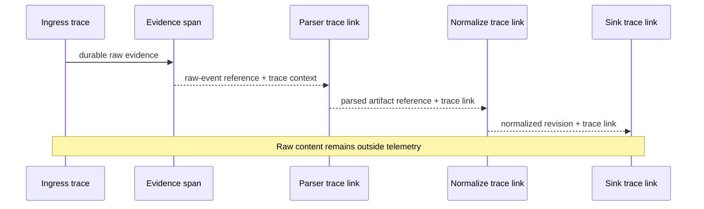

# Observability Architecture

## Objective

ULPF must make processing correctness, losslessness, security, data quality, and operational health visible without leaking raw evidence or secrets into telemetry. Observability is a local, air-gap-capable capability: logs, metrics, traces, health checks, dashboards, and alerts are emitted through documented contracts and can be stored entirely on-premises.

OpenTelemetry is the reference instrumentation standard because it keeps application instrumentation portable across local backends. Prometheus-compatible metrics and Grafana-compatible dashboards are reference deployment choices, not a claim that they are already installed.

## Telemetry design rules

- Telemetry contains stable IDs, hashes/references, status, versions, timings, and bounded error codes—not raw log bodies, secrets, tokens, or unrestricted vendor fields.
- Every pipeline transition propagates a correlation/trace ID, `raw_event_id` reference, source ID, parser/mapping/schema version, and processing stage. Access to these identifiers is still subject to data classification.
- Metrics labels are cardinality-bounded. Raw IDs, IP addresses, arbitrary error strings, and unbounded source fields are not metric labels.
- Logs are structured, redacted, retention-controlled, and linkable to traces. A diagnostic copy of raw evidence is retrieved through the evidence service when authorized, not emitted to a debug log.
- Observability failure must be visible and should not change raw evidence or silently stop deterministic processing; it may trigger safe backpressure or a declared degraded state if critical controls cannot be audited.

## Required signals

| Domain | Metrics/traces/logs to capture | Operational question answered |
| --- | --- | --- |
| ingress | accepted/rejected/quarantined counts, byte rate, source/collector health, spool utilization, durability/write latency | Are sources reaching ULPF and are acknowledgements safe? |
| transport | partition distribution, consumer lag, retry count/age, DLQ rate, rebalance/availability events | Is work accumulating or being delivered out of policy? |
| parsing | success/failure ratio, latency percentiles, timeout/resource-limit events, parser/version health, unknown-format ratio | Which parser/source has regressed or exhausted limits? |
| normalization | validation failures, required-field completeness, unmapped ratio, mapping/schema version outcome | Is standardization trustworthy and complete? |
| evidence/lineage | evidence write/verify failures, manifest seal/verification results, lineage-write failures, privileged access/export | Can custody and traceability be trusted? |
| storage/sinks | object/DB/search/lake latency and error rate, capacity, snapshot/backup status, output delivery state | Is a downstream failure risking backlog or a recovery need? |
| control plane/security | auth/authz failures, pack verification, configuration changes, replay/export requests, sandbox violations | Is an admin/security boundary under attack or misused? |
| optional intelligence | local AI/enrichment availability, latency, confidence distribution, fallback use | Is assistance available without becoming a processing dependency? |

Quality score and source health are product data, not merely dashboard counters. They are stored with versioned definitions and can be queried through APIs; dashboards only visualize them.

## Tracing and correlation

A trace begins at collector/ingress receipt and has spans for evidence write, broker publication, format/source detection, parse, mapping, validation, lineage, each sink, retry, DLQ, replay, and export. Trace links (rather than fake parent/child order) are used when asynchronous messages cross a queue. Span attributes use an approved semantic vocabulary: stage, status, reason code, source class, contract version, parser/mapping/schema version, work ID, and safe evidence reference.

## Health and alert behavior

Each service exposes liveness, readiness, and dependency health without exposing sensitive configuration. Liveness answers whether the process can run; readiness answers whether it can safely accept/perform its assigned work; dependency checks identify degraded conditions such as storage, broker, registry, or identity unavailability. A component must not report ready for durable ingestion if it cannot preserve evidence under its configured policy.

Alerts map to runbooks and use local notification channels in air-gapped deployments. Priority is based on evidence-integrity failures, data-loss risk, security boundary violations, sustained backlog/retry age, storage capacity, backup/restore failures, and service availability. Thresholds, escalation paths, and SLO targets are deployment decisions calibrated through measured behavior; this document does not invent numbers.

## Data retention and access

Operational telemetry has a documented retention, access role, and export policy separate from raw evidence. Audit events and evidence verification results have stronger retention/integrity requirements than ordinary debug logs. Dashboards present classified/redacted values where necessary. All telemetry backends and alert routes must be usable locally in an air gap.

## Technology evaluation

| Candidates | Evaluation criteria | Reference selection | Trade-off / fallback |
| --- | --- | --- | --- |
| OpenTelemetry, vendor SDKs, custom-only telemetry | portability, traces/metrics/logs, air-gap support, ecosystem | OpenTelemetry instrumentation and collectors | adds conventions to learn; a minimal local collector/file exporter can support early phases while preserving semantic contracts |
| Prometheus/Grafana, OpenSearch dashboards, commercial APM | offline deployment, metric query, visualization, cost/licensing, operational load | Prometheus-compatible metrics and Grafana-compatible dashboards | OpenSearch may visualize selected operational data; do not couple application instrumentation to one backend |
| Jaeger/Tempo/OpenSearch traces | trace storage, local operation, team capacity | backend selected during deployment planning behind OTel | start with trace export suited to the chosen local stack; retain correlation contract |

## Acceptance criteria

Future integration tests must show a trace from ingest to each outcome, an alertable evidence-integrity failure, a visible parser resource-limit/DLQ event, bounded-cardinality metric behavior, redaction of raw content from telemetry, and health/readiness behavior during broker/object-store failure. Claims of uptime, latency, or throughput require measured reports under [Performance Strategy](PERFORMANCE_STRATEGY.md).
