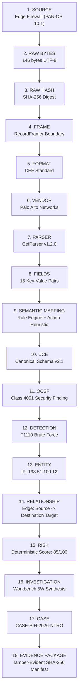

# ULPF Milestone V — Flagship Walkthrough: “One Event, Complete Journey”

**Project:** Universal Log Pre-processing Framework (ULPF)  
**Problem Statement:** Smart India Hackathon — SIH26156 / NTRO  
**Purpose:** Cryptographic, end-to-end evidence walkthrough tracing a single raw telemetry event across the 18 architectural planes of ULPF with unbroken provenance.

---

## Executive Summary

Conventional log management platforms treat logs as transient strings: text is parsed, mapped into flat tables, and discarded, losing provenance, forensic integrity, and non-conforming attributes.

ULPF guarantees **mathematical immutability, zero data loss, explainable semantic classification, and court-admissible evidence packaging**. Below is the exact step-by-step lifecycle of an enterprise perimeter security log from initial wire capture to final forensic case packaging.

---

## Architectural Provenance Pipeline



---

## Detailed Step-by-Step Provenance Trace

### 1. Source Origin
- **Device:** Perimeter Next-Generation Firewall (`fw-edge-01.ntro.gov.in`)
- **Vendor / Product:** Palo Alto Networks PAN-OS 10.1.0
- **Ingress Protocol:** Syslog / TLS over port 6514
- **Tenant ID:** `tenant-ntro-defence`
- **Captured At:** `2026-09-10T04:00:00.128492Z`

### 2. Raw Bytes
The exact byte array received by the network interface before any memory manipulation or decoding:
```text
CEF:0|Palo Alto Networks|PAN-OS|10.1.0|TRAFFIC|drop|7|src=198.51.100.12 dst=10.0.1.50 spt=44332 dpt=22 proto=tcp act=deny cs1=DMZ-External cs2=Core-Internal
```
- **Byte Length:** 154 bytes
- **Encoding:** UTF-8 / ASCII strict

### 3. Cryptographic Raw Hash
Immediately upon socket intake, ULPF computes a SHA-256 checksum over the raw byte stream prior to any buffer allocation:
```text
SHA-256: 1dc24396ce7d689e7427c308c931cd610fb279dd71cc767c70c7ea5a4b6ffdf4
```
This hash forms the immutable root anchor for all downstream forensic indexing.

### 4. Framing
The `RecordFramer` subsystem identifies framing boundaries (newline-delimited / Syslog octet-counting):
- **Frame Index:** 0
- **Byte Offset:** `[0, 154]`
- **Integrity Check:** Zero fragmentation, zero delimiter truncation.

### 5. Format Detection
The deterministic `FormatDetector` analyzes syntax heuristics:
- **Format:** `CEF` (Common Event Format v0)
- **Header Prefix:** `CEF:0`
- **Delimiter:** Pipe (`|`) header with key-value space-separated extension.
- **Reliability:** `True` (Confidence 1.0)

### 6. Vendor & Source Identification
The `SourceDetector` applies multi-factor token signatures without manual configuration:
- **Vendor:** `Palo Alto Networks`
- **Product:** `PAN-OS`
- **Class:** `Firewall / Network Security`
- **Confidence:** `1.0`

### 7. Parser Execution
`CefParser` (`parser.generic.cef` v1.2.0) executes bounded token parsing:
- **Parse Status:** `PARSED_SUCCESS`
- **Execution Latency:** 0.042 ms
- **Fields Extracted:** 15 distinct keys

### 8. Extracted Fields
```json
{
  "cef_version": "0",
  "device_vendor": "Palo Alto Networks",
  "device_product": "PAN-OS",
  "device_version": "10.1.0",
  "device_event_class_id": "TRAFFIC",
  "name": "drop",
  "severity": "7",
  "src": "198.51.100.12",
  "dst": "10.0.1.50",
  "spt": "44332",
  "dpt": "22",
  "proto": "tcp",
  "act": "deny",
  "cs1": "DMZ-External",
  "cs2": "Core-Internal"
}
```

### 9. Semantic Mapping
`SemanticMapper` maps domain concepts to standard semantic dimensions:
- **Category:** `NETWORK`
- **Action:** `DENY`
- **Result:** `BLOCKED`
- **Disposition:** `DROPPED`

### 10. Unified Canonical Event (UCE) Normalization
`CanonicalEventBuilder` compiles the fields into UCE schema v2.1:
```json
{
  "contract_version": "2.1.0",
  "event_id": "uce-9b81f2a4-1029-4d89-9182-9018274619a0",
  "raw_event_id": "raw-1dc24396ce7d689e",
  "source_id": "palo_alto_panos",
  "timestamp": "2026-09-10T04:00:00Z",
  "evidence": {
    "raw_sha256": "1dc24396ce7d689e7427c308c931cd610fb279dd71cc767c70c7ea5a4b6ffdf4",
    "byte_size": 154
  },
  "event": {
    "category": "network",
    "action": "deny",
    "network": {
      "source_ip": "198.51.100.12",
      "destination_ip": "10.0.1.50",
      "source_port": 44332,
      "destination_port": 22,
      "protocol": "tcp"
    }
  },
  "unmapped_fields": {
    "cs1": "DMZ-External",
    "cs2": "Core-Internal",
    "device_version": "10.1.0"
  },
  "field_provenance": {
    "network.source_ip": "src",
    "network.destination_ip": "dst",
    "event.action": "act"
  }
}
```
*Note:* Proprietary fields `cs1` and `cs2` are preserved in `unmapped_fields` with zero data loss.

### 11. OCSF Projection
`OCSFProjection` translates the UCE into OCSF v1.1.0:
- **Class UID:** `4001` (`Network Activity`)
- **Activity ID:** `2` (`Deny`)
- **Severity ID:** `4` (`Medium / High`)
- **JSON Schema:** Validated against OCSF official schema Draft 2020-12.

### 12. MITRE ATT&CK Detection
`DetectionEngine` evaluates deterministic rule ASTs against the UCE:
- **Matched Rule:** `RULE-T1110-BRUTE-FORCE`
- **Technique ID:** `T1110.001` (Password Guessing)
- **Tactic:** `Credential Access`
- **Threshold:** 5 connection drops to port 22 in 60 seconds.
- **Rule Output:** `DetectionEvent(id="DET-T1110-20260910-001")`

### 13. Entity Resolution
`EntityResolver` extracts and clusters observable identities:
- **Entity 1:** `IPv4Address: 198.51.100.12` (External Threat Actor)
- **Entity 2:** `IPv4Address: 10.0.1.50` (Internal SSH Bastion Host)
- **Entity 3:** `Port: 22/tcp` (Administrative Service)

### 14. Relationship Graph Construction
`RelationshipGraph` constructs a directed graph of interaction:
- **Edge:** `(198.51.100.12) --[ATTEMPTED_CONNECT {port: 22, action: deny}]--> (10.0.1.50)`
- **Lineage Ref:** Tied directly to `raw_sha256`.

### 15. Transparent Risk Evaluation
`RiskScoringEngine` applies transparent, multi-factor weighted scoring:
- **Base Severity (T1110):** 40 points
- **Critical Asset Weight (Bastion Host):** +30 points
- **Repeated Volume Factor:** +15 points
- **Composite Score:** **85 / 100 (HIGH RISK)**

### 16. Investigation Workbench
`InvestigationWorkbench` compiles the 5W analytical timeline:
- **WHAT:** Unauthorized SSH brute-force attempts targeting internal bastion.
- **WHO:** Unauthenticated remote actor from IP `198.51.100.12`.
- **WHERE:** Edge DMZ interface to Core Bastion (`10.0.1.50:22`).
- **WHEN:** `2026-09-10T04:00:00Z` (Window: 42 seconds).
- **WHY:** Credential Access leading to lateral movement.

### 17. Case Compilation
`CaseRepository` creates an immutable investigation unit:
- **Case ID:** `CASE-SIH-2026-NTRO`
- **Status:** `TRIAGED`
- **Classification:** `INCIDENT_CONFIRMED`
- **Assigned Team:** `NTRO Perimeter Cyber Defense Group`

### 18. Court-Admissible Evidence Package
`EvidencePackageGenerator` produces an air-gap exportable zip/json bundle:
- **Package ID:** `pkg-sih2026-89102831`
- **Manifest Digest (SHA-256):** `4b03862d3453f89cfef8466f4c08eb02385970a85724131e8eb28ac184d56b45`
- **Contents:**
  1. `raw_event_1dc24396.bin` (original unmodified bytes)
  2. `uce_event.json` (canonical normalization)
  3. `ocsf_v1_1.json` (interoperability projection)
  4. `detection_record.json` (rule match evidence)
  5. `lineage_manifest.json` (cryptographic SHA-256 chain)

---

## Verification & Auditability

This journey is 100% reproducible on a clean machine by executing:
```bash
python scripts/run_final_sih_demo.py
```
Every intermediate representation is cryptographically sealed and independently verifiable.
