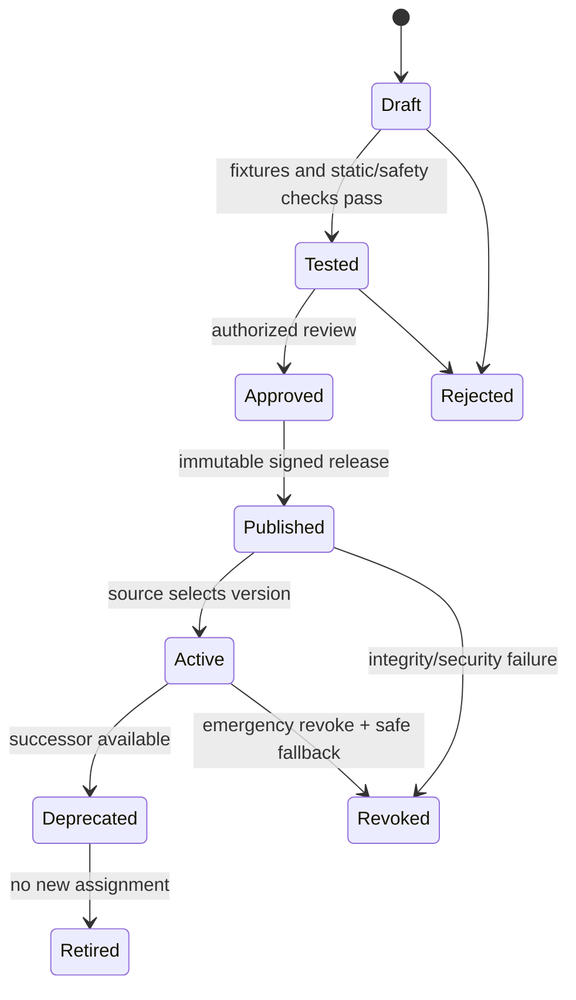

# Parser Architecture

**Status:** Phase 0 design. Parser packs are planned governed artifacts, not installed parser implementations.

## Decision

ULPF separates reusable format interpretation from source-specific semantics:

```text
Format detector -> format adapter -> source profile -> extraction rules
                -> mapping rules -> UCE validation -> output projections
```

The core engine never becomes a collection of unbounded vendor classes. A vendor onboarding normally selects an existing format adapter, adds a source profile and a declarative parser/mapping pack, provides fixtures, passes safety and regression checks, receives approval, and publishes a versioned immutable artifact.

## Parser-pack contract

The machine-readable [Parser contract](../contracts/jsonschema/parser.v1.schema.json) is the minimum manifest. A future pack contains these declared sections:

| Section | Responsibility | Required controls |
|---|---|---|
| Manifest | ID, semantic version, compatible formats/vendors/products/UCE versions, owner | content hash, signature status, approval status |
| Format adapter reference | Syslog, JSON, XML, CSV, CEF, LEEF, key-value, or safe custom parser capability | adapter is selected from a trusted allowlist |
| Source profile | device/vendor/product identity, format hints, timezone, classification, limits | source-specific but not mutable at runtime |
| Extraction rules | typed fields, raw locator/path/span, tokenization/grammar configuration | bounded execution; no untrusted code or dynamic imports |
| Mapping rules | source extracted paths to canonical concepts and controlled vocabularies | distinct mapping version and provenance per output field |
| Transform rules | explicit deterministic conversions, such as timestamp/port/severity | declared inputs/outputs; no hidden defaults |
| Validation | expected types, required conditions, allowed values, compatibility | fail/warn/quarantine disposition per rule |
| Test declaration | sample corpus reference, expected assertions, regression baseline | test report immutable and linked to publication |
| Operational policy | timeout, memory/size limits, fallback behavior, telemetry labels | deny unsafe limits or unsupported runtime |

## Interfaces

| Interface | Input | Output | Failure behavior |
|---|---|---|---|
| `FormatDetector` | RawEvent reference and bounded sample | ranked format candidates with reasons/confidence | unknown/ambiguous result; never drops raw evidence |
| `SourceResolver` | receipt context, device hints, candidates | SourceProfile or unassigned state | routes to review/quarantine if policy requires |
| `FormatAdapter` | bounded raw bytes/text and trusted configuration | structural document/tokens and safe locators | parse error with stage/reason/offset |
| `FieldExtractor` | structure plus rules | ParsedEvent fields with types and observed provenance | partial result plus recoverable residue/warnings |
| `SemanticMapper` | ParsedEvent and mapping version | UCE assertions and unmapped fields | validation failure/DLQ according to policy |
| `ParserRegistry` | immutable version request | approved immutable artifact reference | rejects unsigned, incompatible, revoked, or unauthorized artifacts |

All output uses [RawEvent](../contracts/jsonschema/raw-event.v1.schema.json), [ParsedEvent](../contracts/jsonschema/parsed-event.v1.schema.json), [Mapping](../contracts/jsonschema/mapping.v1.schema.json), and [Parser](../contracts/jsonschema/parser.v1.schema.json) contracts.

## Lifecycle



Publication only alters future processing selection. A processing run pins the exact parser, mapping, schema, and artifact digests. Rollback selects an earlier approved release and produces an audit event; it does not rewrite historical outputs.

## Safety and isolation

Logs are data, not code. A future runtime must:

- Apply ingress size, nesting-depth, field-count, decode, and compression limits before parsing.
- Use linear-time or bounded parsing where possible; vet and bound regular expressions to mitigate ReDoS.
- Run custom/parser-pack execution in a least-privilege worker with CPU, memory, wall-clock, file-system, network, and process-spawn restrictions.
- Disallow shell interpolation, `eval`, dynamic module loading, outbound network access, path traversal, and access to secrets from parser packs.
- Validate structured input against allowed parser grammar; render samples as escaped text.
- Emit parser version, duration, input-size bucket, status, warning/reason code, and source labels for observability.

## Compatibility, health, and drift

Parser compatibility checks test format, source profile, UCE schema version, mapping version, and output adapter versions. Health tracks parse success, partial parse, unknown-field ratio, latency, input-limit failures, and drift signals by source/profile/parser version. A regression or drift alert produces a review candidate; it never auto-edits a published pack.

## Acceptance criteria for implementation

1. A trusted parser pack can be validated, approved, signed, published, activated, deprecated, revoked, and rolled back with an audit trail.
2. Every ParsedEvent contains a raw-event link, parser version, raw locator/provenance for extracted fields, and recoverable parse residue.
3. Untrusted input cannot execute code, escape the worker boundary, or cause unbounded resource consumption under the documented test limits.
4. A compatible new source can use an existing format adapter without changing core parsing code.
5. A pack change has fixture, compatibility, regression, fuzz, and replay-comparison evidence before activation.
