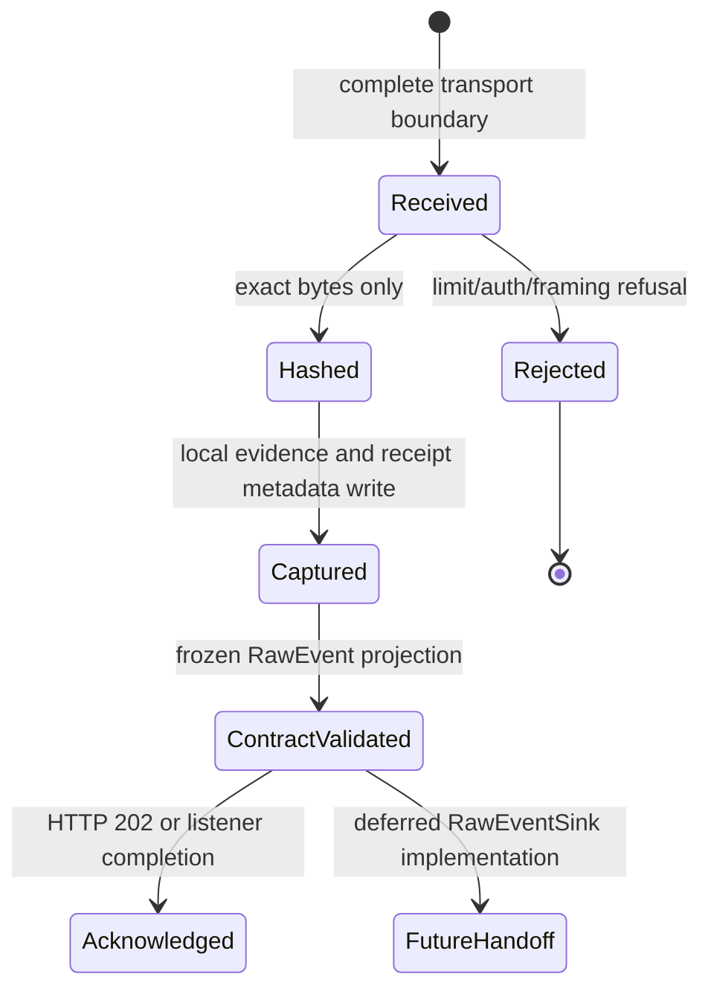

# Raw Event Lifecycle

**Status:** Phase 2 implementation.

Only `captured` is exposed as a successful Phase 2 state. The implementation does not claim `queued`, `processed`, `parsed`, `normalized`, `quarantined`, or delivered because those stages do not exist here.

1. The adapter accepts only a complete HTTP body, complete TCP LF-delimited frame, UDP datagram, or explicit fixture frame.
2. The capture service rejects an oversized payload before creating a receipt.
3. It generates event and receipt UUIDs, records UTC receipt time, and computes SHA-256 over the original `bytes`.
4. The sink persists the bytes and receipt metadata under a generated reference.
5. The service projects and validates the receipt against the frozen RawEvent JSON Schema.
6. HTTP returns a `202 Captured` acknowledgement. TCP and UDP have no ULPF semantic reply protocol.

No payload decoder runs in this lifecycle. Content type, listener identity, peer address, and configured source identity are receipt context, not semantic conclusions.
