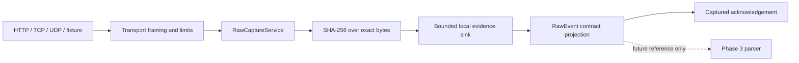

# Raw Intake Architecture

**Status:** Phase 2 implementation. This document describes opaque raw capture only; it does not describe parsing or normalization.

## Purpose and boundary

Phase 2 accepts bounded payload bytes from HTTP, TCP, UDP, and deterministic fixture files. It does not decode, trim, re-encode, inspect, classify, parse, normalize, enrich, correlate, or execute a payload.

`RawCaptureService` is the application boundary. Transport adapters construct a `RawCaptureInput`; the service assigns IDs and receipt time, resolves a source only from transport context, calculates SHA-256 over the supplied `bytes`, writes evidence through `RawEventSink`, then validates the projected document using the frozen `raw-event.v1.schema.json` contract.

## Receipt identity and envelope

Each capture has separate UUIDs for `event_id` (projected as frozen-contract `raw_event_id`) and `receipt_id`. HTTP also retains the request, correlation, and trace IDs created by the platform middleware. TCP and UDP generate a connection/datagram request ID and a connection-local correlation ID. The default `SourceResolver` reports `source_id: unknown`; it never infers a source, vendor, or field from payload content.

The internal `RawEventEnvelope` contains exact payload bytes, SHA-256, byte length, UTC receipt time, transport metadata, source context, and receipt/correlation identifiers. Its frozen-contract projection includes an immutable-reference-shaped `payload` object with URI, SHA-256, byte length, optional received content type, transport protocol, listener ID, and safe peer address when supplied by the transport.

Distinct receptions of equal bytes receive distinct event and receipt IDs. There is no Phase 2 deduplication.

## Evidence boundary

The implemented `LocalFileRawEventSink` is a bounded development/demo fallback. It writes a generated-ID `.raw` byte file and matching JSON receipt metadata atomically, then verifies SHA-256 and length on retrieval. It has configurable event and byte capacities and never evicts an accepted record. The development retrieval endpoint is disabled by default.

This is not the approved S3-compatible immutable evidence store, PostgreSQL catalog, signed manifest chain, or durable stream from ADR-005 through ADR-008. It must not be represented as a production evidence service. HTTP `202 Captured` means the local fallback completed in the running configuration, not that a future object-store/queue pipeline processed the event.

## Security and operations

- HTTP checks declared body size before routing, streams bodies through the event limit, and enforces a header-size limit.
- A fixed-window, process-local request boundary is configured for HTTP. It is deliberately not a distributed rate limiter.
- A configured bearer token is compared with constant-time comparison. Production settings fail validation when no token is injected. This is a narrow interim boundary, not OIDC, mTLS, or device authentication.
- Raw payload content is not written to application logs, acknowledgement bodies, error envelopes, or metric labels.
- TCP/UDP listeners are disabled by default, bind to loopback by default, and use configured bounds.
- There is no runtime Internet call, cloud SDK, Kafka client, parser pack, or external telemetry dependency.

## Deferred dependencies

`RawEventSink` is the handoff/persistence port. The next durable implementation must preserve the same byte/hash/ID invariants before acknowledgement and must not force transports to change. Phase 3 consumes the resulting raw-event reference; it must never mutate evidence bytes or replace receipt metadata.
