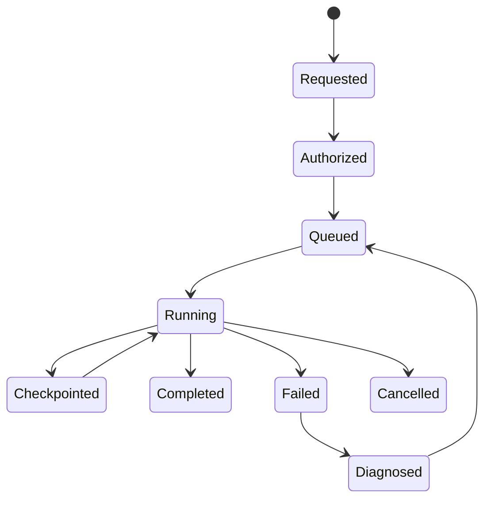

# Replay Architecture

## Purpose and invariant

Replay is a controlled, reproducible re-interpretation of retained raw evidence using explicitly pinned parser, mapping, schema, enrichment, and output-adapter versions. It exists to validate parser changes, repair failures, compare interpretations, backfill a destination, and investigate historical behavior. It never alters raw evidence or overwrites a previous normalized result.

## Replay job

The [ReplayJob contract](../contracts/jsonschema/replay-job.v1.schema.json) fixes the requester, scope, source/time range or sample, target artifact versions, lifecycle status, and results. A request also records its reason, authorization, estimated impact, data classification, target isolation policy, and approval where required.

| Mode | Use | Safety boundary |
|---|---|---|
| Sample | parser/mapping validation and demo comparison | non-production output namespace |
| Range/source | targeted repair or change impact | quota/approval and partitioned execution |
| DLQ | retry known failures after a corrective change | retain original failure record and link retry |
| Full | major migration/backfill | change window, capacity plan, roll-forward/rollback plan |
| Compare | old versus candidate artifacts | write results to separate comparison namespace |

## Lifecycle



```mermaid
sequenceDiagram
  participant User as Authorized operator
  participant Control as Replay control plane
  participant Evidence as Evidence store
  participant Worker as Isolated replay workers
  participant Result as Comparison/result store
  User->>Control: Request scope + pinned versions + reason
  Control->>Control: Authorize, validate compatibility, record audit
  Control->>Evidence: Enumerate immutable raw references
  Evidence-->>Worker: Bounded raw-event references
  Worker->>Worker: Reprocess with pinned artifacts
  Worker->>Result: New result IDs, metrics, differences, failures
  Result-->>Control: Checkpoints and final manifest
  Control-->>User: Reviewable outcome; no historical overwrite
```

## Operational rules

- Replay creates new `normalized_event_id` values and attaches the original `raw_event_id` plus replay job ID.
- Results are isolated from normal downstream sinks unless a separate reviewed promotion/backfill action authorizes them.
- Workers checkpoint source progress and emit deterministic manifests to support restart and reproduce scope/results.
- Replays are rate/space/cost limited, auditable, source/classification authorized, and cancelable.
- Original parser/mapping/schema artifacts remain accessible for historical interpretation, even after deprecation; revoked artifacts have controlled read/replay policy.
- Comparison reports identify field additions, removals, value changes, origin changes, validation/quality changes, and output changes. They do not claim correctness without human review.

## Acceptance criteria for implementation

1. A sample replay with pinned versions is reproducible and produces a signed/auditable result manifest.
2. An old and a candidate interpretation can be compared without overwriting either.
3. DLQ repair links the original failure, fix version, retry result, and raw evidence.
4. Authorization, quotas, checkpoints, cancellation, and sink isolation prevent replay abuse.
