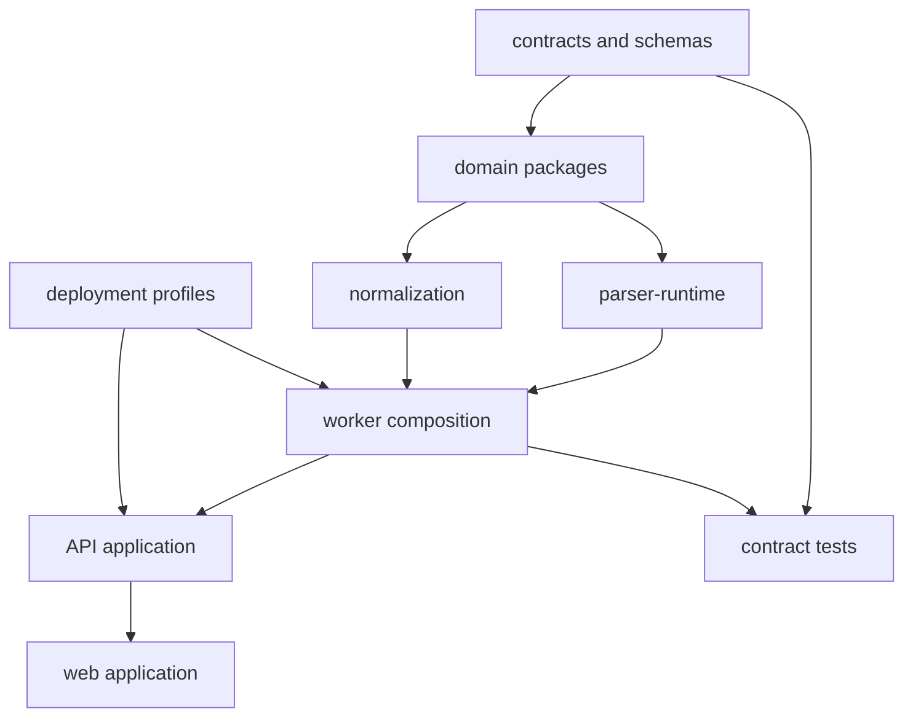

# Repository Architecture

## Current-state assessment

The Phase 0 audit found a blank workspace with no source, configuration, tests, dataset, Docker assets, CI, or Git metadata. No existing work is being migrated or overwritten. Future work must initialize version control before implementation begins and commit this architecture baseline first.

## Planned monorepo structure

```text
.
|- apps/
|  |- api/                    # FastAPI delivery layer only
|  |- worker/                 # processing-worker composition
|  `- web/                    # React/TypeScript operational UI
|- packages/
|  |- domain/                 # UCE and domain types
|  |- parser-runtime/         # safe parser execution interfaces
|  |- normalization/          # semantic mapping and validation
|  |- lineage/                # provenance/integrity services
|  |- integrations/           # SIEM/lake/export adapters
|  `- observability/          # telemetry interfaces
|- contracts/
|  |- jsonschema/             # versioned Phase 0 contract schemas
|  `- openapi/                # generated/curated API description later
|- parser-packs/              # signed declarative packs; no untrusted code
|- schemas/                   # UCE and projection schemas
|- config/                    # non-secret defaults and deployment profiles
|- deploy/                    # OCI, Compose, Kubernetes overlays, air-gap manifests
|- data/                      # ignored runtime data; no evidence committed
|- test-corpus/               # licensed fixtures and manifests only
|- tests/                     # unit, contract, integration, e2e, security, load
|- docs/                      # architecture source of truth
`- tools/                     # reproducible developer/verification tooling
```

## Dependency direction



Rules: dependencies point inward; transport/database/UI code does not contain domain policy; controllers validate and delegate; parser packs remain data; environment-specific values stay out of committed code; runtime evidence never enters Git.
