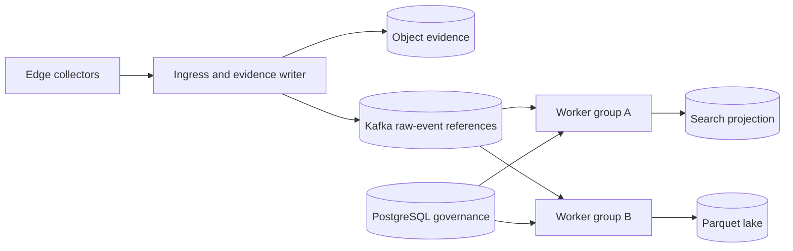

# Resilience, Availability, and Scaling Model

## Scale profiles

| Profile | Planned shape | Objective | Explicit limitation |
| --- | --- | --- | --- |
| Developer | local dependencies or stubs, bounded fixtures | fast contract/parser work | not a performance claim |
| Demo laptop | Docker Compose, single-node service profile, small local corpus | reproducible 2-minute proof | not highly available or billion-event capacity |
| Prototype scale | isolated host, persistent volumes, backup jobs, local identity | end-to-end operational rehearsal | host remains a single failure domain |
| Production scale | replicated brokers, multiple partitions, worker pools, independent search/lake/metadata services | controlled on-premises service operation | capacity and recovery must be tested |
| Enterprise scale | partitioned Kafka, independently scalable workers, replicated/tiered stores, source quotas, capacity planning | horizontal scale and failure isolation | sizing, operations, and disaster recovery are deployment-specific |
| Billion-event/day target architecture | multi-node partitions, autoscaled stateless workers, storage sharding/partitioning, regional operational decisions | design path, not a measured claim | needs sizing, SRE, and hardware evidence |

## Failure behavior

| Failure | Immediate behavior | Recovery path |
| --- | --- | --- |
| Parser worker dies | partition is reassigned or retried; raw evidence remains | restart, inspect health/audit, replay affected offsets |
| Kafka unavailable | bounded edge buffer/backpressure; do not acknowledge beyond durable policy | restore broker then drain with idempotent processing |
| OpenSearch unavailable | continue evidence/normalization where durable route permits; defer indexing | retry index projection and expose degraded search |
| PostgreSQL unavailable | fail closed for governance mutations; processing follows an explicitly configured safe mode | restore metadata store; reconcile audit/outbox records |
| Object store unavailable | do not claim raw capture durability | apply ingress backpressure/reject with explicit telemetry; recover before processing |
| AI/enrichment unavailable | deterministic parse/normalize continues | mark optional stage unavailable and retry independently |
| Network partition | preserve local buffer until bounded limit; expose source health | reconnect, deduplicate, reconcile sequence/late-event flags |

## Design mechanisms

Kafka partition keys use a source/device-consistent key where ordering matters; consumer groups scale workers horizontally. Batching is bounded by byte/event/time limits and governed by backpressure. Retry policies are finite and jittered. Outbox/idempotency records protect non-atomic destination writes. Raw evidence and metadata backups are tested through restore exercises, never assumed reliable without evidence. The object-evidence write precedes publication of each Kafka work reference; workers may write derived artifacts but never replace accepted raw evidence.

