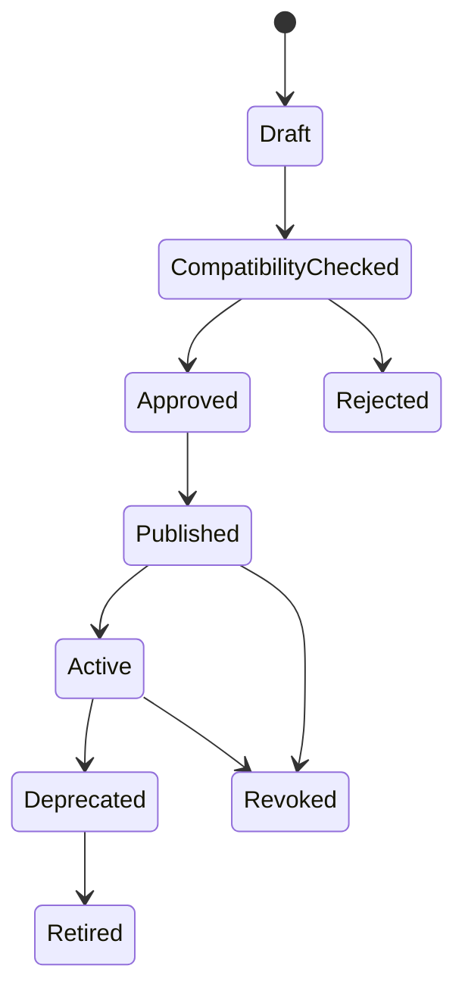
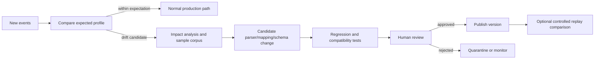

# Schema and Interoperability Strategy

## Decision

ULPF uses a versioned **ULPF Universal Canonical Event (UCE)** as its single internal semantic and lineage-preserving representation. It projects to **OCSF** as the primary cybersecurity interoperability target and uses explicit **OpenTelemetry Logs** and **Elastic Common Schema (ECS)** adapters where those consumers require them. UCE is not a reinvention of every external schema: it is the lossless processing envelope and common abstraction that carries raw evidence references, provenance, quality, unmapped fields, and configuration versions which external projections may not express fully.

The decision is recorded in ADR-001 and ADR-002.

## Canonical hierarchy

**UCE means Universal Canonical Event.** In ULPF, the full name is **ULPF
Universal Canonical Event (UCE)**: the product-owned, versioned internal
canonical representation. It is the only canonical event schema inside ULPF.
It is not OCSF, OpenTelemetry Logs, ECS, or a second competing schema.

RawEvent is immutable evidence, not a canonical semantic event. ParsedEvent is
the source-specific extraction intermediate. UCE is created after approved
mapping and validation. OCSF, OpenTelemetry Logs, ECS, JSON/NDJSON, REST/HTTP,
Kafka, and Parquet are output projections; they cannot replace UCE or mutate
evidence.

~~~mermaid
flowchart LR
  H[Heterogeneous perimeter source] --> R[RawEvent: immutable evidence]
  R --> P[ParsedEvent: source-specific fields]
  P --> U[UCE: ULPF Universal Canonical Event]
  U --> O[OCSF: primary cybersecurity projection]
  U --> T[OpenTelemetry Logs adapter]
  U --> E[ECS adapter]
  U --> X[JSON / NDJSON / REST / Kafka / Parquet adapters]
  R -. raw ID, hash, manifest .-> U
~~~

The OCSF projection is the preferred output for cybersecurity consumers; it
does not make OCSF the ULPF internal canonical schema. A projection failure is
an output-delivery state, not an invalidation of the UCE or its evidence.

## Standards evaluation

| Standard / option | Strengths | Limitations for ULPF | Role |
|---|---|---|---|
| UCE | Owns lossless lineage, origin types, unknown fields, processing/evidence metadata; controlled evolution | ULPF must govern it carefully and maintain adapters | internal contract and source of truth |
| OCSF | Security-oriented classes/categories, broad cybersecurity interoperability | Does not by itself provide ULPF raw-evidence and field-lineage guarantees | primary cybersecurity projection |
| OpenTelemetry Logs | Open observability ecosystem, resource/context concepts, trace correlation | Not a complete security taxonomy or evidence lifecycle | observability/output adapter |
| ECS | Mature Elastic ecosystem conventions and investigation relevance | Tightly shaped for its ecosystem; not an internal lossless contract | optional export adapter |
| Direct vendor-to-standard mapping | Fewer internal objects initially | Couples parser lifecycle and evidence semantics to each target; duplicates work | rejected as core design |

## Registry objects and lifecycle

The [Schema Registry contract](../contracts/jsonschema/schema.v1.schema.json) identifies every schema by ID, semantic version, type, artifact digest, compatibility policy, status, and approval data. Mapping and parser compatibility refer to exact schema versions.

Schema publication is immutable. A schema is active only after reference compatibility, migration documentation, contract tests, and authorized approval. Revocation preserves historical readability while blocking new use.

## Evolution rules

| Change | Version | Required action |
|---|---|---|
| Documentation/validation clarification with unchanged valid payloads | patch | update artifact digest/tests and release notes |
| Optional field or vocabulary addition that compatible consumers can ignore | minor | compatibility test, projection review, migration notes |
| Meaning, requiredness, type, or incompatible structure change | major | new schema ID/version, migration/adapters, explicit consumer plan, ADR if material |
| Source vendor structural change | parser/profile and possibly mapping version | drift review, corpus update, replay comparison; UCE stays stable where possible |

Unknown or source-native fields never require a UCE breaking change; they belong in namespaced extensions/unmapped collections until a governed common mapping is justified.

## Schema drift

Drift monitoring compares observed event structure and values against an active SourceProfile/ParserVersion: missing or new fields, renamed-looking fields, changed types/delimiters/vocabularies, timestamp changes, and structural changes. It records a candidate with sample references and impact analysis. It does not silently alter schema, parser, or mapping selection.

## Acceptance criteria for implementation

1. Every processing result declares its UCE schema, parser, mapping, and projection versions.
2. Schema compatibility is machine-tested before publication, with a documented policy and migration note.
3. An incompatible reader rejects/quarantines unsupported major versions rather than silently coercing them.
4. A new vendor field remains recoverable before it is standardized.
5. Schema drift creates a reviewable, auditable candidate and a regression/replay path.
