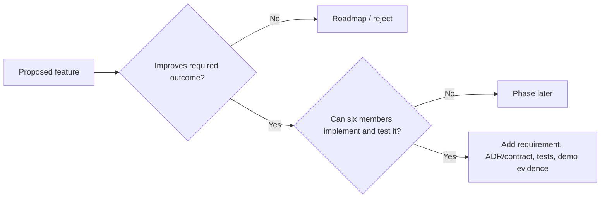

# Product Boundary, Core, and Innovation

## In scope

ULPF Phase 0 targets perimeter network and security telemetry: firewalls, routers, VPNs, IDS/IPS, WAFs, proxies, security gateways, and closely related perimeter-device events. The architecture plans for Syslog, JSON, XML, CSV, CEF, LEEF, key-value, structured vendor, semi-structured proprietary, and unknown formats.

## Out of scope for the core MVP

- A complete SIEM, SOAR, SOC, packet-capture, vulnerability-management, or enterprise observability replacement.
- Claims of support for a vendor, dataset, throughput target, deployment, or security certification without measured evidence.
- Autonomous parser publication, autonomous remediation, arbitrary user code execution, and required online AI.

## Layer A: NTRO core

| Capability | MVP architectural commitment |
| --- | --- |
| Ingest, detect, parse, extract | Bounded ingress interfaces, deterministic format detection, format adapters, and source profiles |
| Normalize and standardize | Versioned UCE with a controlled OCSF projection |
| Losslessness and traceability | Immutable raw evidence reference, SHA-256, versioned parser/mapping/schema, event and field lineage |
| Plug-and-play onboarding | Source, sample, parser-pack, mapping, test, approval, and activation lifecycle |
| Unified visibility | Searchable normalized projection and trace UI boundary |
| SIEM/data lake/ML readiness | OCSF, OTel, ECS, NDJSON, Kafka, and Parquet adapter contracts |
| Big-data path | Kafka partitions, idempotent workers, object storage, search, and lake-scale partitions |
| Air gap/container independence | Local services, signed offline bundles, OCI packaging, no required cloud API |

## Layer B: differentiation

| Priority | Capability | Value | Guardrail |
| --- | --- | --- | --- |
| Must have | Field-level lineage, raw evidence integrity, parser lifecycle, replay | Trustworthy normalization and forensic review | No mutation of raw evidence |
| Should have | Unknown-format analysis, confidence-scored mapping proposals, schema drift | Faster safe onboarding and change control | Human approval before activation |
| Nice to have | Local semantic model, enrichment packs, correlation timeline, Sigma/MITRE context | Demonstrable cyber-analytics value | Downstream of deterministic core |
| Future | Advanced local models, sophisticated anomaly detection, distributed multi-site federation | Scale and depth | Only after benchmarked, secure core |

## Six-member delivery cut

The implementation order preserves every NTRO architectural commitment while
limiting the first working slice to what six students can build, test, and
demonstrate reliably.

| Delivery tier | Included capability | Explicit simplification |
| --- | --- | --- |
| MVP required | bounded perimeter fixtures; raw evidence plus SHA-256; deterministic Syslog/JSON/CEF-style path selected from the lawful corpus; UCE; one OCSF/NDJSON or Parquet projection; source/profile/parser/mapping lifecycle; trace view; DLQ; local Compose profile | Support claims are limited to disclosed fixtures; a single-node demo is not an enterprise benchmark. |
| MVP optional | dictionary-based mapping suggestions, basic structural drift, sample replay comparison, focused quality dashboard | Include only after the deterministic evidence-to-trace path is tested. |
| Post-MVP | local embedding/LLM assistance, broader format adapters, full search/lake topology, richer enrichment, correlation/timeline, ECS/OTel adapters | Must remain advisory or downstream of the deterministic core. |
| Architectural future | multi-site collection, Kubernetes orchestration, graph projection, large-scale autoscaling, advanced anomaly detection | Preserve contracts and scale boundaries now; do not implement early. |

MVP simplification never removes raw evidence preservation, traceability,
parser versioning, explicit failure handling, air-gap operation, or controlled
interoperability. It narrows the number of demonstrated sources, formats,
adapters, and deployment nodes.

## Scope-control gate

A proposed feature enters the MVP only if it demonstrably improves NTRO compliance, security, interoperability, scalability, reliability, usability, or demonstrable innovation. Its owner must state the requirement it supports, its contract impact, test evidence, failure behavior, and demo value. Otherwise it remains a roadmap item.

