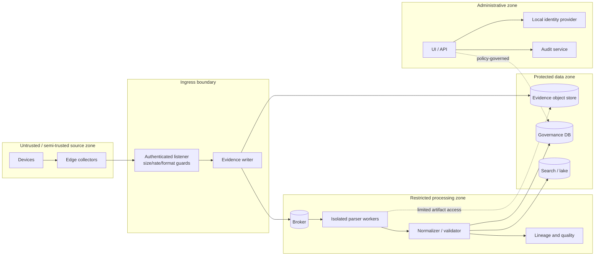

# Security Architecture

## Security objective

ULPF processes potentially hostile, sensitive perimeter-security telemetry. Its security design protects evidence integrity, availability of deterministic processing, confidentiality of event data, integrity of parsers/schemas/configuration, and accountable administration. The primary rule is: **log content is data, never code**.

Security controls are planned architecture. They do not imply a certification, penetration test, or production deployment has occurred.

## Trust boundaries

Network zones are enforced by deployment policy: collectors can reach ingress only; parser workers receive only scoped read/write capability; data stores are not directly exposed to end-user networks; administrative interfaces are isolated and authenticated. A component crossing a boundary authenticates itself and validates inputs.

## Identity, authorization, and audit

The reference identity architecture is an on-premises OIDC-compatible provider (Keycloak is a strong candidate) and short-lived service/user credentials. Local operation is required in an air gap. RBAC is the MVP authorization model; optional attribute/policy checks can later constrain source classification, security domain, and export destination.

| Role | Permitted examples | Explicitly not permitted by default |
| --- | --- | --- |
| Platform Admin | deployment/configuration, user/role administration, approved recovery actions | routine raw-evidence export without a justified approval path |
| Parser Steward | create/test candidate parser, mapping, schema changes; request publication | bypass review, activate unsigned/unvalidated pack, alter raw evidence |
| Security Analyst | search permitted normalized events, investigate lineage, create replay request | change parser/schema policy or access restricted raw bytes by default |
| Auditor / Investigator | verify evidence and audit trail within granted scope | modify configurations or processing results |
| Viewer | bounded dashboard/search projection | raw evidence, exports, administration |

All privileged actions have actor, authenticated subject, purpose, target, before/after version or state, timestamp, source IP/session/correlation ID, authorization result, and outcome in the audit trail. Service identities are unique per workload and never share an administrator credential.

## Data and evidence protection

- TLS or mutually authenticated TLS protects external and service-to-service transport according to deployment boundaries.
- Sensitive data is classified at ingestion and protected by storage encryption, least-privilege retrieval, redacted projections, and audited exports. Redaction applies to displays/copies, never the exact evidence object.
- Raw evidence, manifests, parser packs, schema packs, and backups receive independent integrity checks and access scopes.
- Encryption keys, signing keys, and secrets are separated by purpose. Logs, images, repositories, and parser configuration may not contain plaintext credentials.
- Retention, legal hold, and deletion are policy- and approval-controlled. Evidence is never deleted as a convenience response to processing errors.

## Untrusted-input and parser controls

| Threat surface | Required controls |
| --- | --- |
| network log payload | strict size/frame limits, encoding-safe handling, bounded decompression, rate limits, content treated as opaque data |
| regex/parser rules | pre-publication tests, bounded regex engine/timeouts where available, CPU/memory/wall-clock limits, no runtime code evaluation |
| uploaded samples/packs | quarantine, file type and size validation, content scanning where available, path canonicalization, signed approved packs only |
| parser worker | isolated container/process, non-root user, read-only filesystem, dropped capabilities, no host socket, restricted egress, scoped artifact access |
| APIs/UI | schema validation, authentication/authorization before lookup, parameterized queries, output encoding, CSRF/session controls appropriate to chosen auth flow |
| export/replay | quotas, approval/role policy, source/classification scope, audit, rate/concurrency limits |

Parser extensions use declarative configuration and a reviewed interface rather than arbitrary vendor code. If code plugins are later necessary, they are signed, sandboxed, capability-limited, scanned, and separately reviewed. See [ADR-013](adr/ADR-013-parser-isolation-and-content-safety.md).

## Configuration, supply chain, and operations

Configuration is versioned, validated, and separate from secrets. Deployment images and air-gap bundles include a software bill of materials, pinned dependency digests, signature/digest verification, and vulnerability-review workflow. Parser/schema/mapping pack activation is an auditable promotion from candidate to approved version, with a rollback path that does not erase history.

The system emits security-relevant telemetry for failed authentication, denied authorization, privilege changes, evidence-integrity failures, pack verification failures, parser sandbox violations, unusual export/replay activity, and configuration changes. Sensitive raw payloads and secrets are excluded from telemetry. Alerting routes are a local deployment choice and must work without Internet access.

## Technology evaluation

| Concern | Candidates | Evaluation criteria | Reference choice | Trade-off / fallback |
| --- | --- | --- | --- | --- |
| identity | Keycloak, another OIDC provider, local directory integration | offline support, OIDC standards, RBAC integration, administration burden | OIDC-compatible local identity service; Keycloak is the reference candidate | Keycloak adds operations; existing government/on-premises identity may federate through the same OIDC/SAML boundary after review |
| secrets | environment files, encrypted secret store, platform secret manager | non-disclosure, rotation, air-gap compatibility, audit | deployment-managed secret store/files with strict permissions; no source-controlled secrets | simple protected files may support a demo, but rotation/audit requirements remain |
| isolation | process limits, containers, microVMs | parser blast radius, portability, performance, team feasibility | hardened non-root containers/process isolation for MVP | microVMs are a future hardening option when justified |
| artifact trust | unsigned files, hashes only, signed bundles/packs | offline verification, key lifecycle, operator usability | signed packs/bundles plus digests and SBOM | unsigned local development artifacts must be visually marked and cannot be promoted to air-gapped production |

## Security acceptance criteria

Before a production-like claim, test authorization denial, raw-evidence access control, API input validation, parser resource exhaustion containment, malicious path/archive handling, signed-pack rejection, secret leakage scanning, evidence tamper detection, backup access restriction, and no-egress air-gap behavior. Results must report measured scope and limitations, not an unsupported assurance claim.
