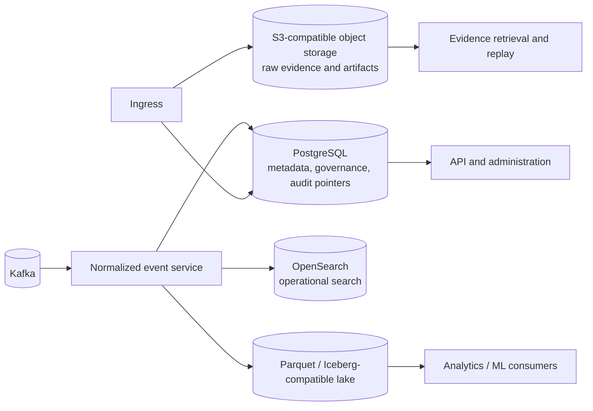

# Storage Architecture

## Purpose

ULPF separates evidence custody, operational metadata, search, analytical data, and transport state. No datastore is treated as a universal source of truth. The authoritative source for original bytes is the evidence store; PostgreSQL governs durable configuration and workflow state; OpenSearch accelerates operational exploration; the lake retains analytics-optimized standardized data; the broker moves work.

The plan is deliberately compatible with a hackathon-sized local deployment and a later distributed deployment. It does not claim the current repository has deployed any of these stores.

## Data ownership and access patterns

| Store | Authoritative data | Primary access pattern | Not responsible for |
| --- | --- | --- | --- |
| S3-compatible object storage (MinIO reference) | exact raw bytes, evidence manifests, parse artifacts, export packages, replay inputs | retrieve by immutable object reference/hash; stream large artifacts | relational configuration or broad free-text operational search |
| PostgreSQL | sources, parser/schema/mapping versions, jobs, retention policy, evidence pointers, audit indexes, authorization metadata | transactional administration and lookup by ID | high-volume raw payloads or dashboard-scale event search |
| OpenSearch | derived, indexed normalized-event projections and aggregate dashboards | time-bounded filtering, pivots, correlation-oriented exploration | original evidence authority or irreversible configuration history |
| Parquet with Iceberg-compatible tables | immutable/append-oriented normalized analytical records and curated aggregates | partition scans, analytics, ML feature preparation | low-latency transactional workflow |
| Kafka-compatible broker | transient but durable processing log, retry and control messages | ordered work/replay within configured retention | long-term evidence archive |

## Object-store layout and integrity

Object keys are generated from opaque IDs and time partitions; they do not embed unsanitized source names or log content. Suggested logical prefixes are `evidence/raw/`, `evidence/manifests/`, `artifacts/parsed/`, `artifacts/normalized/`, `quarantine/`, and `exports/`. Each object has a recorded content type, byte length, SHA-256, encryption metadata, retention state, and `raw_event_id` or artifact ID.

Raw evidence objects are written before downstream processing. Versioning and immutable-retention controls are enabled where the deployment supports them. A caller retrieves the object through an authorization-checked evidence service; a direct object-store credential is not the normal analyst interface. The full design is in [Evidence Architecture](EVIDENCE_ARCHITECTURE.md).

## PostgreSQL logical model

The following are logical entities, not a premature physical schema:

| Domain | Core records | Key relationships and indexes |
| --- | --- | --- |
| governance | `source`, `source_profile`, `parser_version`, `mapping_version`, `schema_version`, `policy` | immutable version IDs; source-to-active-profile lookup; approval/audit indexes |
| evidence catalog | `evidence_record`, `evidence_manifest`, `evidence_access` | `raw_event_id`, hash, object reference, time/source index; no raw blob column |
| workflows | `processing_job`, `replay_job`, `dlq_event`, `drift_finding` | state, owner, correlation ID, scheduled time, source and version indexes |
| lineage and audit | `lineage_record`, `field_lineage`, `audit_event` | raw/event/output ID traversal; append-only sequence and actor/time index |
| security | users/federated subjects, roles, grants, export approvals | least-privilege policy lookup and immutable audit references |

Foreign-key integrity is used for configuration and workflow metadata where it improves correctness. High-volume lineage may use partitioned tables or an append-only event store with indexed references; its retention cannot be shorter than the events it explains.

## OpenSearch projection strategy

OpenSearch receives only a derived projection of normalized events plus selected lineage/evidence references. Every document contains `raw_event_id`, normalized event ID, output revision, schema/parser/mapping versions, classification, event and ingestion times, and quality state. It must never be the sole copy of raw evidence or the only record of a processing result.

Indexes are time-partitioned and use index lifecycle policies. Mapping templates are versioned and deny unbounded dynamic mapping by default; vendor-specific/unmapped content is retained as a controlled flattened or referenced structure to prevent field explosion. Search fields containing sensitive data are classified and redacted or access-filtered according to policy, without modifying the evidence object.

## Lifecycle, retention, and archival

Retention is policy-driven by data classification, source, legal/forensic requirement, and available capacity. A policy change is an audited administrative action and cannot silently shorten protected evidence retention.

| Data class | Hot | Warm/archive | Deletion rule |
| --- | --- | --- | --- |
| raw evidence and manifests | retrievable from primary evidence storage | encrypted replicated archive | only after approved retention expiry; hold overrides expiry |
| normalized search projection | fast OpenSearch tier | lake remains queryable after search rollover | index lifecycle may remove the projection, never its evidence linkage |
| analytical lake | queryable recent partitions | compacted/archive partitions | policy expiry plus catalog and manifest update |
| broker topics | bounded operational retention | not an evidence archive | expiry only after durable downstream acknowledgment policy |
| metadata/audit | transactional primary plus backups | archived audit partitions | policy-controlled, typically at least as long as governed evidence |

## Backup and restore

Backups are encrypted, access-controlled, integrity-checked, and tested by restore exercises. They cover PostgreSQL, object-store metadata and immutable manifests, OpenSearch snapshots, lake catalog/metadata, and deployment configuration. Kafka replication and topic retention reduce interruption risk but do not replace a recovery plan. Restore order is: identity/secrets and configuration, PostgreSQL governance catalog, evidence/object storage, manifests and audit indexes, lake catalog, search projections (rebuildable from normalized artifacts), then broker/worker services. See [Disaster Recovery](DISASTER_RECOVERY.md).

## Security controls

- Encrypt data in transit and at rest; manage keys separately from storage credentials.
- Restrict raw evidence retrieval, export, deletion, retention overrides, and parser publication through least-privilege roles and audited approvals.
- Do not place credentials, raw log bodies, or unbounded exception payloads in application logs.
- Verify object hash and manifest membership on retrieval/export; quarantine inconsistent objects rather than repairing them invisibly.
- Use non-root storage service accounts, network segmentation, backup immutability where supported, and signed offline updates.

## Technology evaluation

| Concern | Candidates | Evaluation criteria | Selected direction | Trade-off / fallback |
| --- | --- | --- | --- | --- |
| governance DB | PostgreSQL, MariaDB, document DB | transactional integrity, maturity, offline support, team familiarity | PostgreSQL | relational migrations add discipline; a compatible managed PostgreSQL deployment is a deployment variation, not a contract change |
| evidence store | MinIO/S3-compatible, filesystem, distributed object store | immutable objects, checksums, lifecycle, air-gap deployability | S3-compatible object storage; MinIO is the reference local implementation | filesystem is only a bounded demo fallback and must still preserve hashes/manifests |
| search | OpenSearch, Elasticsearch, PostgreSQL FTS | security-event queries, aggregation, offline licensing, operations | OpenSearch projection | it adds a service; PostgreSQL filtered views are a temporary MVP fallback, not a scale claim |
| analytical format | Parquet, JSON files, proprietary warehouse | columnar scans, schema evolution, offline portability | Parquet, with Iceberg-compatible table management | JSON is a debug/export format only |

## Acceptance criteria

The design is accepted when tests demonstrate that an exact raw payload can be retrieved and hash-verified after a parser/search failure; a search index can be rebuilt without evidence loss; a duplicate delivery cannot overwrite a distinct receipt; retention and legal hold actions are audited; and a backup restore verifies manifests before returning evidence to service.
