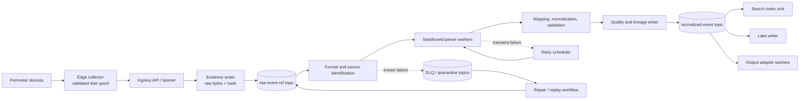
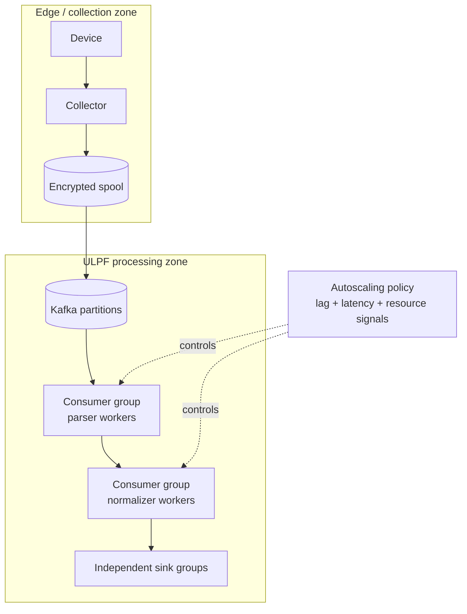

# Streaming Architecture

## Purpose and decision

ULPF uses a durable, partitioned event stream to decouple collection, deterministic processing, storage, and downstream delivery. The stream carries versioned **references to preserved evidence**, not an unbounded copy of raw payloads. This is deliberate: raw evidence is made durable before an event is accepted for asynchronous processing.

The target transport is Apache Kafka in KRaft mode behind a broker-neutral transport interface. It is an architectural target rather than a claim that the Phase-0 repository runs Kafka. A single broker is acceptable for a developer or hackathon demo; production resilience requires a replicated deployment. See [ADR-007](adr/ADR-007-durable-streaming-architecture.md).

### Non-negotiable properties

- Every acknowledged event has a `raw_event_id`, exact raw-byte hash, source identity, and durable evidence location.
- Delivery is at-least-once. Sinks are idempotent; duplicate evidence is retained and linked rather than discarded.
- Per-source ordering is preserved where the transport and collector can provide it. ULPF does not promise a global order.
- Backpressure, retries, late data, and failures produce observable state and an explicit route; none are silently dropped.
- A broker outage must cause durable edge buffering or an explicit ingestion refusal, never a false acknowledgement.

## Processing topology

`raw-event-ref` is only published after the evidence writer has persisted the exact input bytes and evidence metadata. Processing stages append lineage records and publish a new immutable work reference; they do not overwrite the raw event.

## Topic and envelope contract

Topic names are configuration, not hard-coded API. The following logical topics define the minimum contract.

| Logical topic | Producer | Consumer | Key | Payload responsibility |
| --- | --- | --- | --- | --- |
| `raw-event-ref` | ingestion | detection/parser workers | `source_id` | `RawEvent` reference, content hash, ingest sequence, correlation IDs |
| `parse-result-ref` | parser workers | normalization workers | `raw_event_id` | parsed-field artifact reference, parser/version, warnings |
| `normalized-event-ref` | normalizer | search, lake, export sinks | `raw_event_id` | normalized event reference, quality, lineage root, schema/version |
| `retry-*` | retry controller | owning stage | original key | immutable work reference plus attempt and scheduled time |
| `dlq-*` | owning stage | quarantine/replay service | `raw_event_id` | failure category, safe diagnostic, stage and artifact references |
| `control-*` | registry/replay services | workers | registry or job key | version activation, drain, replay, and health control events |

All data-plane messages must include: contract version, event/work ID, `raw_event_id`, source ID, event-time and processing-time when known, trace/correlation IDs, artifact versions, attempt count, and a payload/reference digest. The maximum inline payload size is a deployment policy; oversized payloads are evidence objects with a reference, never truncation.

## Partitioning, ordering, and time

The default key is a stable `source_id`. It gives a deterministic processing order for one source without forcing unrelated devices into a hot partition. A source profile may opt into a more granular key (for example, source plus collector shard) only after documenting the ordering trade-off.

- Kafka offsets order records only within a partition. They are not evidence timestamps.
- `event_time` is the source-observed timestamp and may be absent, invalid, late, or skewed. `ingested_at` and each stage's `processed_at` remain separate.
- A late event follows normal processing and is labelled with lateness metadata; it is not rejected merely for age.
- If a device sequence number exists, retain it as observed data and record gaps or reordering in lineage. ULPF does not synthesize a sequence number as evidence.

## Delivery, retries, and failure state

Workers commit a transport offset only after their idempotent output and associated lineage/failure record are durable. A retryable error uses bounded, jittered retries and a scheduled retry topic. The retry policy is versioned configuration with a maximum attempt count, TTL, and an operator-visible reason.

| Condition | Required behavior | Terminal state |
| --- | --- | --- |
| parser timeout or temporary dependency failure | retry within resource and attempt limits | quarantine after exhaustion |
| malformed or unsupported input | preserve evidence, classify, route to DLQ | `quarantined` or `unknown_format` |
| schema/semantic validation failure | preserve parsed artifacts and errors; allow repair or replay | `validation_failed` |
| storage/index/output sink failure | pause/slow the affected consumer, retain stream backlog, alert | degraded sink; no raw loss |
| poison message or worker crash | isolate worker, persist diagnostic, retry under policy | quarantined if non-recoverable |

The DLQ is an evidence-preserving workflow, not a bin for deleted messages. It records an opaque diagnostic safely; raw log content is not copied into operational logs.

## Idempotency and duplicate handling

Each collector submission obtains a unique `raw_event_id`. A duplicate fingerprint may be calculated from exact bytes, source identity, and a bounded time context, but it never authorizes deletion. The normalized/search/lake sinks use idempotency keys that include `raw_event_id`, transformation version, and output target. A retry therefore converges on the same output revision while distinct receipt attempts remain traceable.

## Backpressure and resilience

Edge collectors use an encrypted, quota-governed local spool. They advertise capacity and source health. When the broker or ingress is unavailable, collectors store before forwarding; when the spool reaches its configured safe limit they expose a backpressure state and reject or throttle according to the source protocol. That state is auditable and alertable.

At central stages, consumer lag, queue depth, retry age, and storage latency drive autoscaling in a future clustered deployment. Scaling a worker group does not change the partitioning rule, and partition-count changes are planned operations because they can alter key distribution.

## Scale path

| Environment | Intended topology | Guardrail |
| --- | --- | --- |
| developer | local broker or test transport, one worker per stage | fixtures only; no throughput claim |
| hackathon demo | single-node containerized broker and bounded fixtures | demonstrate behavior, not enterprise capacity |
| single-node production-like | durable volumes, monitored broker, separate worker processes | document single-node failure domain |
| moderate production | replicated brokers, multiple partitions and consumer replicas | test rebalance and recovery |
| large enterprise | multi-broker cluster, capacity-planned partitions, isolated sink groups and tiered storage | prove with measured workload tests; do not infer billions/day capability |

## Technology evaluation

| Candidates | Evaluation criteria | Selected architecture | Trade-off and fallback |
| --- | --- | --- | --- |
| Apache Kafka, Redpanda, NATS JetStream, direct in-process queue | durable replay, partitioning, ecosystem, air-gap packaging, operations burden, team capacity | Kafka-compatible durable log; Apache Kafka/KRaft is the reference target | Kafka adds operational complexity. Redpanda is an acceptable compatible deployment fallback after contract and recovery tests. An in-process queue is test-only, not a production substitute. |

## Observability and acceptance

Every stage emits OpenTelemetry traces linked by correlation ID, plus metrics for ingestion rate, partition skew, consumer lag, retry count/age, DLQ rate, worker saturation, processing latency, and sink health. Alert thresholds are deployment configuration; they must be measured and tuned, not invented in documentation.

Architecture acceptance requires a controlled test showing a worker crash, broker interruption, duplicate delivery, malformed input, out-of-order events, and downstream outage. In each case reviewers must be able to find the raw evidence, explicit status, retry/DLQ record, and final lineage outcome.
