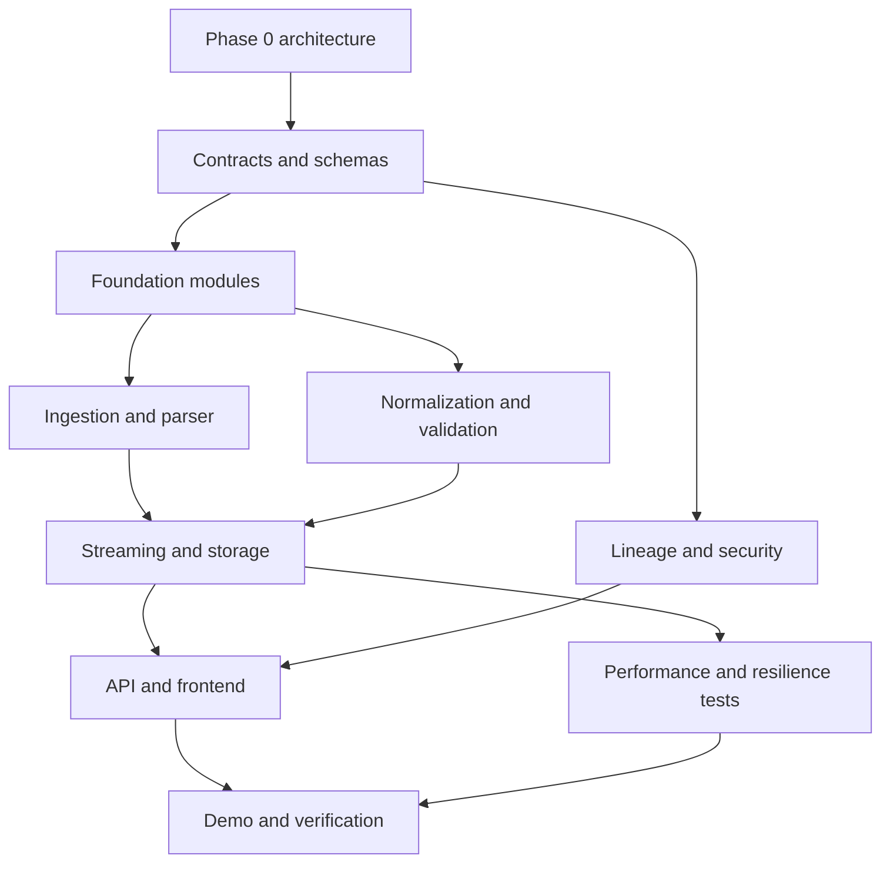

# Six-member Team Strategy and Dependency Graph

## Work split

| Member/workstream | Primary ownership | Contract boundary | Early deliverable |
| --- | --- | --- | --- |
| 1. Platform/API | domain services, API composition, governance | JSON schemas and OpenAPI | source/parser/mapping lifecycle skeleton |
| 2. Ingestion/parser | collectors, format detection, parser runtime/packs | RawEvent and ParsedEvent | safe Syslog/JSON/CEF sample path |
| 3. Schema/normalization | UCE, mappings, validation, OCSF projection | ParsedEvent to NormalizedEvent | canonical fields and mapping tests |
| 4. AI/onboarding | unknown-sample analysis, proposals, approval UX/API | Mapping proposal and audit contracts | offline advisory prototype only |
| 5. Data/SRE/security | Kafka/storage/lineage, air-gap, telemetry, CI security | artifact, lineage, deployment contracts | reproducible demo profile and integrity check |
| 6. Frontend/demo | operational UI, flows, accessibility, demo narrative | versioned API client models | event trace and onboarding UI |

Each workstream owns tests for its boundary, reviews cross-boundary changes, and cannot change versioned contracts unilaterally. Weekly integration uses an agreed fixture corpus and a compatibility matrix.

## Dependency graph

Critical path: contracts/schemas -> deterministic ingestion/normalization -> evidence/lineage -> stable API/UI trace -> integration and demo validation. Independent early work: frontend shell using mocks, corpus curation, deployment manifests, and documentation. High-risk work: parser safety, lossless semantics, schema changes, air-gap bundles, and truthful benchmark execution.
