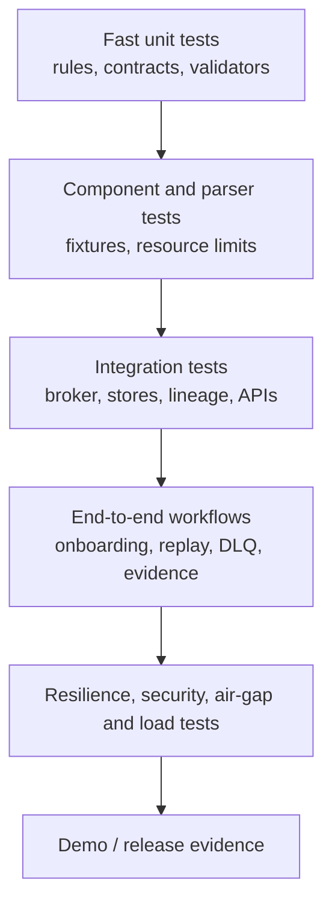

# Test Strategy

## Objective

The ULPF test strategy proves architectural invariants before feature breadth: raw evidence is retained exactly, every output is traceable, parser/schema/configuration changes are versioned and safe, deterministic processing remains available without AI/Internet access, and failures follow explicit observable paths. Tests are planned for future phases; this document does not claim they have run.

## Test layers

| Layer | Scope | Examples | Gate |
| --- | --- | --- | --- |
| unit | deterministic, isolated behavior | canonical mapping, timestamp conversion, hash calculation, validation rule, access policy decision | required for changed logic |
| contract | versioned interfaces and schemas | RawEvent/ParsedEvent/NormalizedEvent compatibility, API error semantics, parser-pack metadata | no breaking change without version/migration decision |
| parser/component | parser configuration/rules against fixture corpus | valid/malformed/Unicode/large input, unknown fields retained, timeout and ReDoS boundary | candidate cannot publish without declared coverage |
| integration | real interfaces among bounded services | evidence write then stream reference, idempotent sink, registry approval, storage failure | test the configured deployment profile |
| end-to-end | user/business workflow | known source, unknown-log onboarding, investigator trace, DLQ repair, replay/rollback | required for phase acceptance/demo path |
| non-functional | resilience, security, air-gap, accessibility, performance | broker outage, object restore, signed-bundle rejection, authorization denial, no-egress, load corpus | risk-based release gate |

## Invariant test catalogue

| Invariant | Minimum evidence of test |
| --- | --- |
| no silent raw loss/mutation | exact bytes and hash retrievable after parse/index failure, retry, duplicate, and replay |
| output traceability | traverse normalized field/output to raw evidence, versions, transformation and audit records |
| unknown-field recovery | representative unknown vendor fields remain reachable through artifact/reference without index explosion |
| version integrity | parser/schema/mapping activation, rollback, and replay retain historic version explanations |
| explicit failure path | malformed, unsupported, timeout, dependency, and validation failures have reason/status, retry/DLQ/quarantine evidence |
| AI advisory boundary | unavailable AI does not block known deterministic parsing; suggestions cannot publish without validation/approval |
| air-gap operation | isolated environment performs core workflow without egress/dependency fetch |
| security boundary | unauthorized access, malicious input, unsigned pack, path traversal, resource exhaustion are rejected/contained/audited |
| data quality | completeness/coverage/drift rules yield versioned outputs and do not overwrite raw evidence |

## Parser, schema, and regression testing

Each parser pack has a versioned fixture corpus, expected parsed fields, expected canonical mapping, known unknown fields, error cases, resource expectations, and compatibility target. A parser change runs current fixtures plus retained historical regressions; it generates a human-reviewable diff in parsed/normalized output and quality. Schema/mapping changes use compatible sample suites, contract evolution tests, and output comparisons. Any intentional semantic change needs release notes, migration/replay policy, and lineage-visible versions.

Fuzzing targets parsers, format detection, uploads, API inputs, archive handling, and regular expressions with resource limits enforced. Fuzz inputs are isolated and preserved only under a safe test-data policy; security findings do not require retaining sensitive raw production evidence in a test repository.

## Failure, recovery, and replay tests

Chaos/failure tests are scoped to the available environment: crash a worker, slow/unavailable search or lake sink, interrupt the broker, block evidence storage, restart after partial completion, restore a backup, and activate then rollback a bad parser. Expected results are explicit retry/backpressure/DLQ/replay records and preservation of raw evidence. Replay tests pin a historical parser/mapping/schema set, compare revisions, and prove previous output was not overwritten.

## Air-gap and supply-chain tests

An air-gap test prevents DNS/Internet egress and verifies local ingest, parsing, registry access, evidence verification, search/replay, local auth, and observability. Bundle tests validate a known-good signed bundle, reject a modified/unknown-signer bundle, prove compatibility checks, and exercise rollback. Dependency/image/security scanning is performed in an authorized build environment; its signed results accompany the offline package, not a runtime cloud dependency.

## Test data and environments

Tests use the curated corpus and synthetic fixtures described in [Dataset Strategy](DATASET_STRATEGY.md). Fixtures are minimized, licensed/provenanced, de-identified as appropriate, immutable by version, and separated from benchmark workloads. Environment configuration is declarative; tests must not rely on a developer’s local credentials, live external services, or untracked hardware logs.

## Quality gates and reporting

Every phase defines its own acceptance gate tied to requirements and ADRs. A change report identifies test suite/version, environment, pass/fail/skip reasons, coverage limitations, relevant benchmark results if any, and unresolved risks. A skipped security, integrity, or air-gap test is not silently green. Test metrics help identify gaps but do not replace scenario-based proof of invariants.

## Test execution sequence

1. Run fast contract/unit tests locally.
2. Run parser/schema regression suites for affected packs.
3. Run integration tests against versioned local dependencies.
4. Run targeted security, failure, and air-gap tests before a release/demonstration.
5. Run reproducible performance tests separately using [Performance Strategy](PERFORMANCE_STRATEGY.md), preserving the results and limitations.
6. Update documentation/ADRs when a test reveals a contract or architecture change.
