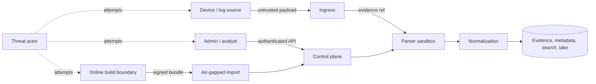

# Threat Model

## Scope and method

This threat model uses a STRIDE-oriented review of ULPF’s principal trust boundaries: device/collector ingress, parser execution, evidence custody, control-plane registries, administrative APIs, exports/replay, deployment supply chain, and air-gap updates. It addresses the architecture described in Phase 0; it is not a completed security assessment.

Assets requiring protection are exact raw evidence and manifests, parser/schema/mapping packs, credentials and signing keys, normalized/derived data, audit/lineage records, availability of ingestion and deterministic processing, and the integrity of replay/export outcomes.

## Assumptions and non-goals

- Source devices and their log contents may be compromised; ULPF must preserve and safely process their output, not vouch for its truth.
- An operator controls the air-gapped boundary and trusted public keys. Physical compromise, a stolen signing key, or a fully compromised administrator requires incident response beyond application controls.
- ULPF is not a full SIEM/SOAR, endpoint agent, packet-capture system, or network security appliance.
- Availability targets, recovery objectives, and classification policies are deployment decisions; Phase 0 does not invent values.

## Threat register

| ID | Threat / STRIDE class | Attack path and impact | Required mitigations | Residual risk / verification |
| --- | --- | --- | --- | --- |
| TM-01 | Malicious log payload; tampering/elevation | payload attempts command/template/script execution | content is data; schema validation, output encoding, no dynamic evaluation, sandbox parser | parser-library defects remain; adversarial fixture and code review tests |
| TM-02 | Regex denial of service; DoS | crafted input triggers catastrophic parsing | regex linting/tests, bounded engine/timeout, CPU/memory/wall-clock limits, DLQ | false positives/performance trade-offs; fuzz and load tests |
| TM-03 | Oversized/compressed event; DoS | memory/disk exhaustion or decompression bomb | size/framing/decompression limits, collector quotas, spool policy, rate limits | legitimate large evidence needs policy exceptions and test corpus |
| TM-04 | Parser or pack tampering; tampering | malicious configuration/code changes event meaning or escapes worker | signed/versioned packs, review/approval, sandbox, least privilege, audit, rollback | trusted signer compromise; key rotation and incident drill |
| TM-05 | Raw evidence tampering; repudiation | object or manifest modified/deleted | immutable storage controls, SHA-256, append-only manifests, signed Merkle seals, backups | privileged infrastructure compromise; independent key custody and restore verification |
| TM-06 | Unauthorized event/raw access; information disclosure | weak role/tenant/scope enforcement or direct store access | OIDC, RBAC/policy checks, data classification, separated store credentials, audited access/export | admin misuse; least privilege, dual approval where justified |
| TM-07 | SQL/search injection; elevation/tampering | API values become a query or script | typed request schemas, parameterized database access, constrained search DSL, allowlists | application bugs; SAST/DAST and authorization tests |
| TM-08 | Path traversal/malicious upload; tampering/DoS | sample or bundle writes outside quarantine | generated object keys, canonical paths, quarantine, archive validation, no host mounts, signature verification | scanner gaps; negative tests |
| TM-09 | Credential/session compromise; spoofing | stolen bearer token, service secret, admin session | short-lived credentials, MFA/policy where available, rotation, service identity, secure session handling, audit/anomaly alerts | compromised endpoint; revocation and incident runbook |
| TM-10 | Broker/storage outage; DoS | transport or downstream unavailable causes loss/false acknowledgement | durable edge spool, at-least-once/idempotency, consumer lag alerts, retry/DLQ, degraded mode | bounded buffers; capacity policy and restore drills |
| TM-11 | Replay/export abuse; information disclosure/DoS | unbounded job reprocesses data or exports protected evidence | role/approval scope, quotas, concurrency/rate limits, destination/purpose audit | legitimate incident surge; emergency procedure and capacity planning |
| TM-12 | Schema/mapping drift or malicious change; tampering | normalized interpretation changes silently | versioning, drift detection, review, lineage, dual-run comparison/replay | semantic errors need human review and corpus coverage |
| TM-13 | AI prompt injection/data poisoning; tampering | logs influence local model mapping proposal or poisoning input | isolate untrusted text, fixed prompts/templates, no tools/code execution, confidence/explanation, human approval, curated feedback, model/version provenance | model can still mislead reviewer; AI advisory only |
| TM-14 | Malicious AI-generated mapping; tampering | unsafe or inaccurate mapping reaches production | validation, test corpus, approval workflow, signed publication, deterministic runtime | reviewer error; regression tests and rollback |
| TM-15 | Supply-chain compromise; tampering | poisoned dependency/image/update reaches enclave | pinned digests, SBOM, scans, signed bundles, offline verification, provenance review | zero-day/trusted build compromise; staged rollout and revocation |
| TM-16 | Container compromise; elevation | vulnerable workload escapes or reaches data stores | non-root, read-only FS, dropped capabilities, network policies, resource limits, patching | kernel/runtime bugs; host hardening and segmentation |
| TM-17 | Audit/lineage deletion; repudiation | attacker hides a change or access | append-only audit, separate permissions/storage, evidence seals, monitoring | privileged compromise; backup and independent review |
| TM-18 | Unknown/proprietary field flood; DoS/data quality | 10,000 dynamic fields exhaust mapping/index | retain controlled unmapped artifact, deny dynamic mapping by default, field/cardinality limits | reduced immediate searchability; onboarding workflow |

## Security response principles

1. Preserve the disputed evidence and diagnostic metadata before remediation where safe.
2. Contain affected workers/credentials/packs, revoke or disable activation, and record the control-plane decision.
3. Do not silently regenerate evidence, audit, lineage, or normalized records.
4. Use pinned replay to produce corrected output after an approved fix; retain the earlier output and its explanation.
5. Treat integrity, signature, authorization, and sandbox violations as high-priority observable events.

## Risk review and acceptance

The highest design risks are untrusted parsing, privileged pack publication, evidence-store compromise, access-control mistakes, and offline update-chain compromise. Their mitigations must be demonstrated by focused security tests before any production-like deployment. Threats that cannot be fully eliminated—compromised source devices, authorized insider misuse, and vulnerabilities in trusted dependencies—require detection, least privilege, recovery, and operational ownership rather than a false guarantee.

This model is reviewed when a trust boundary, identity system, parser capability, AI integration, export destination, or deployment topology changes. Material changes require an ADR or threat-model update before implementation.
