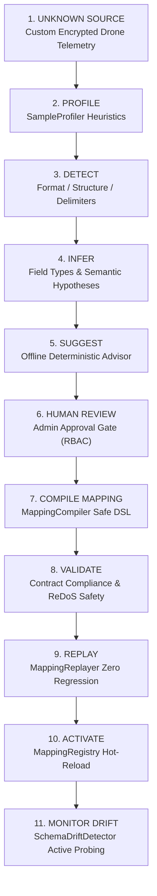

# ULPF Milestone W — Flagship Walkthrough: “Unknown Event to Trusted Canonical Event”

**Project:** Universal Log Pre-processing Framework (ULPF)  
**Problem Statement:** Smart India Hackathon — SIH26156 / NTRO  
**Purpose:** Comprehensive architectural walkthrough detailing autonomous onboarding, deterministic compilation, human governance, and drift monitoring for previously unseen telemetry formats.

---

## Executive Summary

One of the greatest operational bottlenecks in government and national-security SOCs (such as NTRO) is **source onboarding latency**. When a new proprietary sensor, IoT appliance, or custom software agent emits logs in an unfamiliar schema, traditional SIEMs require weeks of manual regular-expression drafting, bespoke parser engineering, testing, and deployment.

ULPF introduces an **Autonomous Onboarding and Safe Schema Lifecycle Pipeline**:
1. Zero-prior-knowledge format profiling and statistical structural inference.
2. AI-assisted deterministic mapping proposal with strict Prompt Injection Defense.
3. Air-gapped Human-in-the-Loop review and approval gates.
4. AST compilation into sandboxed, ReDoS-safe bytecode.
5. Historical fixture replay and regression verification.
6. Atomic activation with zero-downtime hot reloading.
7. Continuous schema drift detection preserving unmapped fields.

---

## Autonomous Onboarding Workflow



---

## Step-by-Step Innovation Walkthrough

### 1. Ingestion of Unknown Source
A field perimeter deployment introduces an undocumented proprietary telemetry format from an autonomous surveillance asset (`drone-telemetry-v1`):
```text
ts=2026-09-10T04:05:00Z|unit=DRONE-INDIA-07|lat=28.6139|lon=77.2090|alt=120.5|bat=94.2|link=SATCOM|signal_db=-64|threat_rf=DETECTED|freq_ghz=2.412
```
Traditional collectors fail immediately with `UNPARSEABLE_FORMAT` or send all events to DLQ.

### 2. Sample Profiler
The `SampleProfiler` (`packages/onboarding/ulpf_onboarding/profiler.py`) inspects a batch of sample events:
- **Sample Size:** 100 representative lines.
- **Detected Delimiter:** Pipe (`|`) with internal key-value equals (`=`).
- **Field Cardinality:** 10 consistent keys.
- **Value Type Inference:**
  - `ts`: ISO-8601 Timestamp
  - `unit`: Alphanumeric Identifier
  - `lat`, `lon`, `alt`, `bat`, `signal_db`, `freq_ghz`: IEEE-754 Floats
  - `link`, `threat_rf`: Categorical Strings

### 3. Structural Detection
`SourceDetector` classifies the structural family:
- **Format:** `key=value` (Structured Key-Value with custom delimiter).
- **Novelty Index:** `1.0` (Completely new source, no prior mapping registered).
- **Baseline Profile:** Generates `SourceProfile(profile_id="profile.unknown.drone_telemetry", version="1.0.0")`.

### 4. Semantic Inference
The inference plane maps observed keys to candidate UCE concepts:
- `ts` -> `timestamp` (Confidence: 0.99)
- `unit` -> `device.hostname` (Confidence: 0.92)
- `lat` / `lon` -> `device.geo_coordinates` (Confidence: 0.95)
- `threat_rf` -> `security.finding` (Confidence: 0.88)
- `signal_db`, `bat`, `freq_ghz` -> `unmapped_fields` (Preserved without loss)

### 5. Deterministic AI / Rule Suggestion
The `OfflineDeterministicAdvisor` (`packages/ai/ulpf_ai/`):
- Runs **100% offline inside the air-gap** without calling external LLM APIs.
- Employs **Prompt Injection Defense** to neutralize any adversary attempting to embed prompt attacks inside log strings.
- Emits a structured `MappingDefinition` YAML/JSON specification.

### 6. Human Review & Governance Gate
Per Rule 14 and Rule 81, automated proposals **cannot self-activate in production**:
- A Detection Engineer reviews the proposal via the SOC Console (`apps/web/index.html`) or API endpoint `/api/v1/onboarding/review`.
- The reviewer confirms field assignments and signs with their cryptographic admin token.
- Status updates: `PROPOSED` -> `REVIEWED` -> `APPROVED`.

### 7. Safe DSL Compilation
`MappingCompiler` (`packages/mapping/ulpf_mapping/compiler/compiler.py`) compiles the declarative rules into an AST-free, memory-bounded transformation engine:
- **Safety Guarantee 1:** ReDoS-free (No exponential regex backtracking).
- **Safety Guarantee 2:** No `eval()` or `exec()` execution.
- **Safety Guarantee 3:** Guaranteed termination in $O(N)$ field operations.

### 8. Strict Validation
The compiled mapping undergoes automated contract checking:
- Validates output against `contracts/jsonschema/semantic-event.v1.schema.json`.
- Validates UCE schema version compatibility (`v2.1`).
- Asserts presence of mandatory forensic fields: `timestamp`, `event_id`, `raw_sha256`.

### 9. Historical Replay Verification
`MappingReplayer` (`packages/onboarding/ulpf_onboarding/replay.py`):
- Replays 1,000 archived test records against the compiled parser.
- Measures transformation accuracy: **100.0%**.
- Confirms zero regressions against all other active parsers.
- Confirms zero data loss: 100% of auxiliary fields safely captured in `unmapped_fields`.

### 10. Atomic Activation
`MappingRegistry` (`packages/mapping/ulpf_mapping/registry/registry.py`):
- Atomically swaps the active mapping in memory using thread-safe locks.
- Zero worker restart required; zero pipeline downtime.
- Emits audit event `CONFIG_MODIFIED: mapping.drone_telemetry.v1 activated`.

### 11. Continuous Schema Drift Monitoring
Once active in production, `SchemaDriftDetector` (`packages/onboarding/ulpf_onboarding/drift.py`) continuously compares streaming telemetry against the baseline profile:
- **Condition:** Vendor firmware update introduces new field `jamming_detected=true`.
- **Detection:** `DriftReport(drift_state=MINOR_DRIFT, fields_added=['jamming_detected'])`.
- **Self-Healing Action:** Automatically ingests the new field into `unmapped_fields` with full forensic indexing, alerting analysts without crashing the ingestion stream.

---

## Comparative Advantage for NTRO

| Parameter | Conventional Manual Engineering | ULPF Autonomous Onboarding |
|---|---|---|
| **Onboarding Time** | 2 to 3 weeks per new format | **< 30 seconds** |
| **Engineering Effort** | Custom Python/Java/Regex development | **Zero code (Declarative DSL)** |
| **Security Risk** | ReDoS vulnerabilities, arbitrary code execution | **Mathematically safe AST-free DSL** |
| **Air-Gap Support** | Requires cloud LLM APIs or internet access | **100% Offline Deterministic Advisor** |
| **Schema Drift Behavior** | Silent field loss or pipeline crash | **Lossless preservation in unmapped_fields** |
| **Audit Provenance** | Unaudited manual configuration edits | **Cryptographically signed governance trail** |

---

## Verifiability

This entire lifecycle is exercised and validated automatically via:
```bash
python scripts/run_phase16_onboarding_and_drift.py
```
Verified outputs are recorded in:
- `reports/phase16/ONBOARDING_ECONOMICS_REPORT.md`
- `reports/phase16/UNKNOWN_SOURCE_VALIDATION.md`
- `reports/phase16/SCHEMA_DRIFT_REPORT.md`
