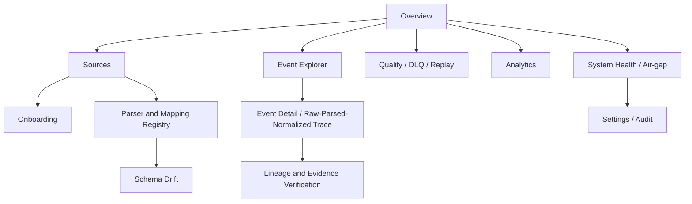

# UX Flows

## Design posture

ULPF's UI is an operational, security-sensitive console, not a generic dashboard. It must make evidence, uncertainty, system state, access constraints, and consequences visible. Every destructive, publication, replay, import, or export action presents scope, version, authorization, and audit impact before confirmation.

## Flow catalogue

| Flow | Actor and trigger | User path | Backend objects/operations | Success / failure / audit |
|---|---|---|---|---|
| A. New source onboarding | Parser Publisher starts a known source | Create source -> declare ingress/profile -> upload bounded sample -> select parser/mapping -> test -> request approval -> activate | Source, Sample, ParserVersion, MappingVersion, ParserTest, AuditEvent | Active source with pinned versions; validation failures remain drafts; each transition audited |
| B. Unknown format onboarding | Publisher submits unknown sample | Safe preview -> deterministic structure analysis -> candidate fields/format -> optional local AI proposal with confidence -> edit -> test -> review -> publish | SampleAnalysis, MappingProposal, SourceProfile, Parser/Mapping draft | Proposal cannot activate itself; ambiguity/unsafe input goes to review/quarantine; approval audit |
| C. Parser review | Authorized reviewer sees pending pack | Inspect manifest, diff, fixture report, safety/compatibility results, replay comparison -> approve/reject | ParserVersion, test report, signature/compatibility data | Approved immutable release or rejection rationale; reviewer identity/audit |
| D. Parser publication | Publisher promotes approved version | Select source scope and rollout policy -> review effects -> publish -> monitor health -> rollback if needed | ParserVersion, Source activation, AuditEvent | New runs pin version; poor health/detected issue yields explicit rollback option; never alters history |
| E. Schema drift | Analyst receives drift alert | Review evidence samples, impact, trend -> create candidate change or mute with reason -> test/review/publish | DriftEvent, Sample, Parser/Mapping/Schema draft | Candidate is governed; dismissal needs rationale; audit preserves decision |
| F. Event investigation | Analyst finds an event | Filter/search -> inspect summary/quality -> compare raw/parsed/normalized -> trace selected field -> export permitted view | NormalizedEvent, RawEvent reference, Lineage, AuditEvent | Clear data origin and access masking; failed evidence fetch shows status/correlation, not false absence |
| G. Raw-to-normalized trace | Analyst/Auditor selects field | Select canonical field -> see value/origin/confidence -> raw locator/escaped context -> transformations/versions -> integrity check | FieldAssertion, LineageRecord, EvidenceRecord | Verified/mismatch/unavailable state is explicit; raw access is audited |
| H. Replay | Authorized operator requests reprocessing | Pick scope -> choose pinned versions -> estimate -> authorize -> start -> monitor/checkpoint -> compare -> promote only if approved | ReplayJob, artifact refs, result manifest | New isolated results; capacity/authorization failure leaves request auditable |
| I. DLQ recovery | Analyst opens failure queue | Filter reason/stage -> inspect retained raw metadata -> choose fix/retry/escalate -> track result | DLQEvent, RawEvent, ReplayJob | Resolution links old failure and new run; retry exhaustion remains visible |
| J. Evidence verification | Auditor verifies an event/export | Open evidence record -> recompute/check digest and manifest -> view custody/access history -> export signed manifest if allowed | EvidenceRecord, integrity manifest, AuditEvent | Clear verified/mismatch/unavailable result; never silently accepts mismatch |
| K. Air-gap status | Administrator checks deployment | View connectivity policy, local registry/bundle versions, signature verification, dependency health -> stage/import/activate bundle | AirGapStatus, BundleManifest, AuditEvent | Failed verification blocks activation and names safe remediation; no external fetch action |

## Frontend state rules

- Loading conveys which resource/version is being queried and supports cancellation for long operations.
- Empty states distinguish no authorization, no data, no configured source, filtered-out data, and unavailable dependency.
- Error states show a safe message, correlation ID, retryability, and the next permissible action; raw input is not echoed.
- Real-time updates are advisory indicators; a resource is refreshed from the authoritative API before a critical decision.
- Tables support dense investigation with saved, bounded filters and visible timezone/time-origin choices.
- Keyboard navigation, focus restoration, semantic controls, contrast, and non-color status cues are required.

## Frontend information architecture

